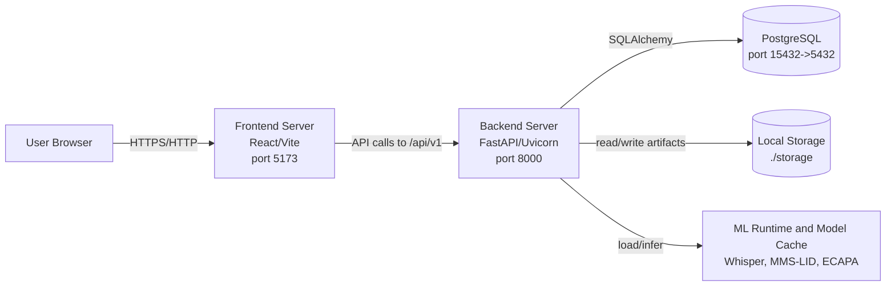

# Deployment View

The current deployment is a local or VM-style deployment. PostgreSQL can run in Docker, while the backend and frontend run as separate development servers. Audio and transcript artifacts are stored on the backend host filesystem under `storage/<audio_id>/`.
