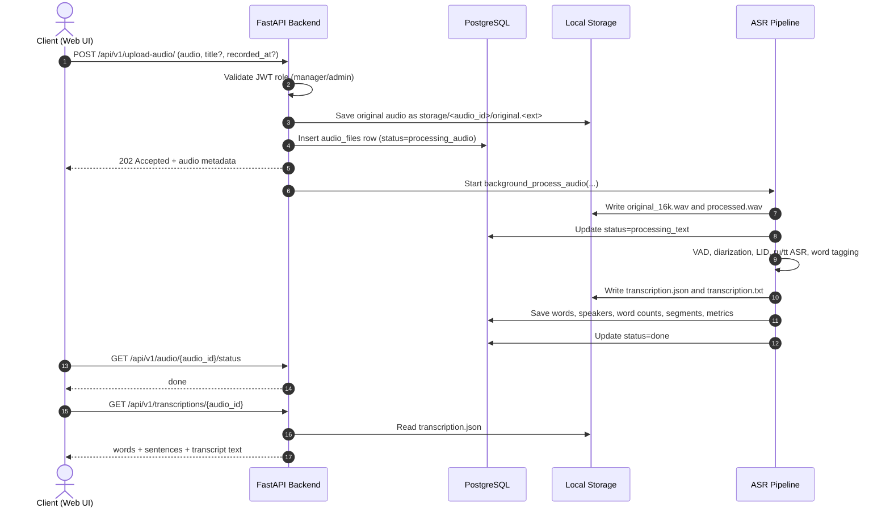

# Dynamic View

The upload endpoint returns before ASR processing is complete. The frontend relies on status polling and then fetches the transcript, audio, or statistics through protected API endpoints.
