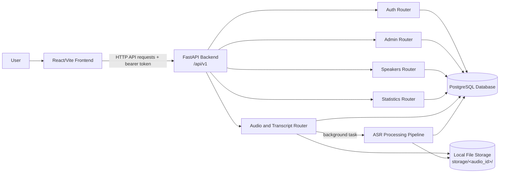

# Static View

The backend is the central integration boundary. It enforces authorization, exposes API endpoints, starts the processing pipeline, serves stored artifacts, and writes searchable metadata to PostgreSQL.
