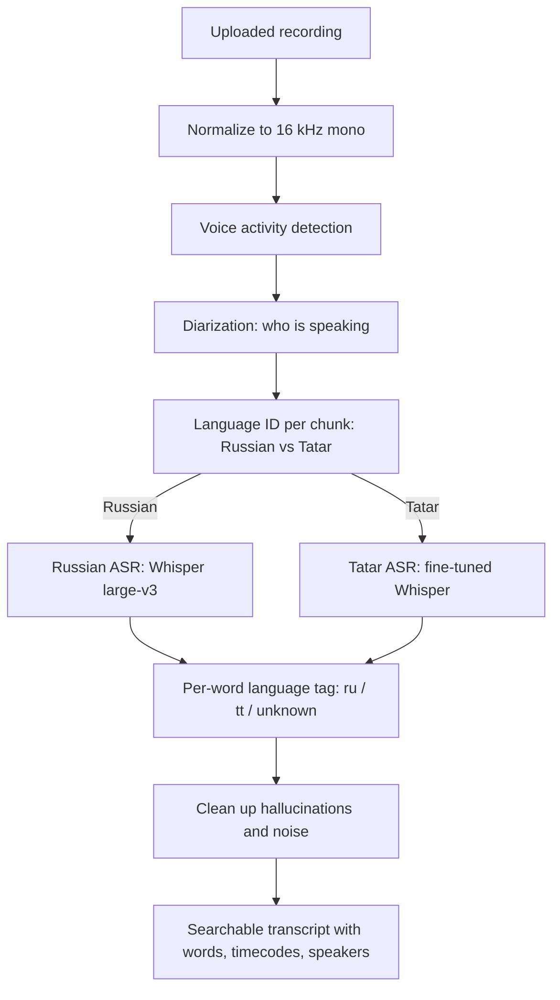

# Improving ASR Accuracy: Customer Guide

**Audience:** the person who owns and uses the corpus, without assuming machine-learning background.

This guide explains how speech recognition works today, what the customer can do immediately to improve results, when model training becomes useful, and how to measure whether accuracy actually improved.

## One-Sentence Summary

Every transcript correction is valuable: it fixes the current recording, improves search/statistics, and creates verified data that can later be used to fine-tune a stronger model.

## 1. How ASR Works Today

The application does not use one single model. Uploaded audio passes through a chain of steps:



| Step | What it decides | Typical mistake |
|---|---|---|
| Language ID | Whether a chunk is Russian or Tatar. | Sends Tatar speech to the Russian model or vice versa. |
| Russian ASR | Russian words. | Occasional mistakes on noisy or quiet speech. |
| Tatar ASR | Tatar words. | More spelling errors because public Tatar ASR is weaker. |
| Word language tag | Labels each word as `ru`, `tt`, or `unknown`. | Tatar words written with Russian letters can be mislabeled. |
| Cleanup | Removes hallucinated/noisy tokens. | Can occasionally drop a real quiet word. |

Tatar is the hardest part. The Russian model is strong and trained on a much larger data base. The Tatar branch currently uses `yasalma/whisper-finetuned-tt-asr`, which is useful but still has more spelling and routing errors.

## 2. Two Meanings of Training

People use "train the ASR" for two different activities:

- **Teaching the system without ML:** correct transcripts, label speakers, and extend the Tatar word list. This helps immediately and creates training data.
- **Training the model:** fine-tune or replace the Tatar model so it makes fewer mistakes before manual correction.

The practical sequence is to correct and label data first, then use that verified data for model fine-tuning when there is enough of it.

## 3. What the Customer Can Do Now

### Correct Transcripts

Managers and admins can correct words, change language tags, insert missing words, delete phantom words, and bulk-edit selected words. These changes update:

1. the transcript shown in the UI;
2. the searchable word index;
3. recording statistics.

Corrections do not automatically retrain the model today. They do create the verified dataset needed for future fine-tuning.

### Label Speakers

Rename anonymous labels such as `Speaker 1` to meaningful labels such as mother, father, or child. This makes speaker-filtered search and speaker statistics useful.

### Extend the Tatar Word List

Some Tatar words are written only with Russian Cyrillic letters. Add only unambiguous Tatar words to:

```text
backend/src/data/tatar_wordlist.txt
```

Rules:

- one lower-case word per line;
- lines beginning with `#` are comments;
- do not add words that are also normal Russian words.

Words with Tatar-specific letters are already detected automatically and do not need to be added.

### Improve Recording Quality

Better audio usually beats software tuning:

- turn off TV/radio and other background speech;
- place the microphone closer to the child;
- prefer a quiet room;
- avoid dishes, running water, and other sharp background noises near the microphone.

## 4. Model-Level Improvements

### Swap in a Stronger Existing Tatar Model

The Tatar ASR model is selected through:

```text
TT_ASR_MODEL
```

The current default is `yasalma/whisper-finetuned-tt-asr`. If a stronger compatible Tatar Whisper model becomes available, an engineer can point this variable at it and run the evaluation harness.

### Fine-Tune on Corrected Corpus Data

Fine-tuning requires `(audio clip, verified transcript)` pairs. Customer corrections are the source of those pairs. A typical workflow is:

1. Export corrected Tatar audio/text examples.
2. Fine-tune a Whisper-compatible Tatar checkpoint offline on a GPU.
3. Publish or store the resulting model.
4. Set `TT_ASR_MODEL` to the new model.
5. Evaluate before adopting it.

Fine-tuning should be repeated as the corrected corpus grows.

### Improve Russian/Tatar Routing

If many errors come from Tatar speech being sent to the Russian model, the next improvement is a dedicated Russian/Tatar language classifier or shorter routing windows. This is separate from the ASR model itself.

## 5. How to Measure Improvement

Run the ASR quality harness:

```bash
python scripts/QualityRequirements/transcription_quality_test.py
```

Use this discipline:

1. Run the harness before a change.
2. Make one change.
3. Run the harness again.
4. Compare language tags, spelling readability, hallucinations, and dropped words.
5. Keep the change only if it clearly improves results without introducing regressions.

Final judgment should include listening to representative customer recordings.

## 6. Recommended Path

1. Record cleaner audio and correct the transcripts that matter most.
2. Label speakers consistently.
3. Add safe Russian-letter Tatar words to the word list.
4. Periodically rebuild/reindex statistics if needed.
5. Try a stronger Tatar model through `TT_ASR_MODEL` when available.
6. Fine-tune once there is a solid set of corrected Tatar recordings.

## 7. FAQ

**Do corrections retrain the model automatically?**  
No. They update transcripts, search, and statistics immediately. They also accumulate the dataset for future fine-tuning.

**Is Russian recognition already good enough?**  
The Russian branch is strong. Most remaining accuracy gains are expected in Tatar recognition and Russian/Tatar routing.

**I added a word to the Tatar list and Russian words are mislabeled. What happened?**  
The added word is probably also a Russian word. Remove it from `tatar_wordlist.txt` and correct only the specific transcript occurrences.

**How much corrected data is enough to fine-tune?**  
There is no hard threshold. A few dozen well-corrected recordings can help; more verified data is better. Evaluate every fine-tuned model before adoption.

## Related Engineering Documents

- [RU/TT Pipeline](ru_tt_pipeline.md)
- [Storage and Search](storage_and_search.md)
