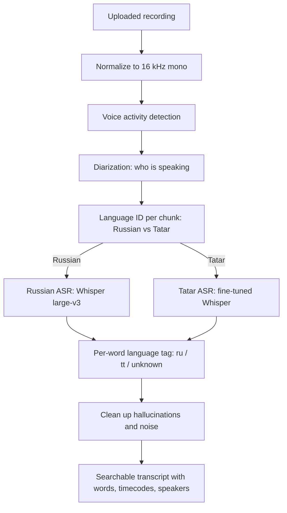
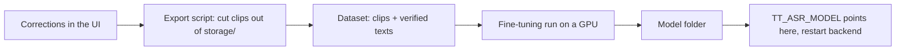

# Improving ASR Accuracy: Customer Guide

**Audience:** the person who owns and uses the corpus, without assuming machine-learning background.

This guide explains how speech recognition works today, what the customer can do immediately to improve results, when model training becomes useful, and how to measure whether accuracy actually improved.

## One-Sentence Summary

Every transcript correction is valuable: it fixes the current recording, improves search/statistics, and creates verified data that can later be used to fine-tune a stronger model.

## 1. How ASR Works Today

The application does not use one single model. Uploaded audio passes through a chain of steps:



| Step | What it decides | Typical mistake |
|---|---|---|
| Language ID | Whether a chunk is Russian or Tatar. | Sends Tatar speech to the Russian model or vice versa. |
| Russian ASR | Russian words. | Occasional mistakes on noisy or quiet speech. |
| Tatar ASR | Tatar words. | More spelling errors because public Tatar ASR is weaker. |
| Word language tag | Labels each word as `ru`, `tt`, or `unknown`. | Tatar words written with Russian letters can be mislabeled. |
| Cleanup | Removes hallucinated/noisy tokens. | Can occasionally drop a real quiet word. |

Tatar is the hardest part. The Russian model is strong and trained on a much larger data base. The Tatar branch currently uses `yasalma/whisper-finetuned-tt-asr`, which is useful but still has more spelling and routing errors.

## 2. Two Meanings of Training

People use "train the ASR" for two different activities:

- **Teaching the system without ML:** correct transcripts, label speakers, and extend the Tatar word list. This helps immediately and creates training data.
- **Training the model:** fine-tune or replace the Tatar model so it makes fewer mistakes before manual correction.

The practical sequence is to correct and label data first, then use that verified data for model fine-tuning when there is enough of it.

## 3. What the Customer Can Do Now

### Correct Transcripts

**Where in the interface:** log in, open the **Аудиозаписи** tab on the dashboard, and select a recording. Its transcript appears with each word clickable. Clicking a word opens the **Правка слова** dialog, where you can fix the spelling and set **Язык слова** to `Русский`, `Татарский`, or `Другой`. The same view is used to add a missing word, delete a phantom one, and rename a speaker.

Managers and admins can correct words, change language tags, insert missing words, delete phantom words, and bulk-edit selected words. These changes update:

1. the transcript shown in the UI;
2. the searchable word index;
3. recording statistics.

Corrections do not automatically retrain the model today. They do create the verified dataset needed for future fine-tuning.

### Label Speakers

Rename anonymous labels such as `Speaker 1` to meaningful labels such as mother, father, or child. This makes speaker-filtered search and speaker statistics useful.

### Extend the Tatar Word List

Some Tatar words are written only with Russian Cyrillic letters. Add only unambiguous Tatar words to:

```text
backend/src/data/tatar_wordlist.txt
```

Rules:

- one lower-case word per line;
- lines beginning with `#` are comments;
- do not add words that are also normal Russian words.

Words with Tatar-specific letters are already detected automatically and do not need to be added.

### Improve Recording Quality

Better audio usually beats software tuning:

- turn off TV/radio and other background speech;
- place the microphone closer to the child;
- prefer a quiet room;
- avoid dishes, running water, and other sharp background noises near the microphone.

## 4. Model-Level Improvements

### Swap in a Stronger Existing Tatar Model

The Tatar ASR model is selected through:

```text
TT_ASR_MODEL
```

The current default is `yasalma/whisper-finetuned-tt-asr`. If a stronger compatible Tatar Whisper model becomes available, an engineer can point this variable at it and run the evaluation harness.

### Fine-Tune on Corrected Corpus Data

Fine-tuning means taking the current Tatar model and continuing its training on your own corrected recordings, so it makes fewer mistakes on the speech you actually record. Section 5 is the full step-by-step procedure; it assumes no machine-learning background, only the ability to run commands in a terminal.

### Improve Russian/Tatar Routing

If many errors come from Tatar speech being sent to the Russian model, the next improvement is a dedicated Russian/Tatar language classifier or shorter routing windows. This is separate from the ASR model itself.

## 5. Fine-Tuning Step by Step

This section is the practical recipe: where the training pairs come from, where they are stored, how to train, and where the finished model goes.

The cycle as a whole:



**Note on tooling.** Steps 5 and 6 use what already exists in the application. Steps 2 and 4 — the export and the training run — are **not yet implemented in this repository**; an engineer has to write them once, and this section specifies exactly what they must do. After that first implementation, every later round is just re-running them.

### Step 0. What You Need

| Requirement | Details |
|---|---|
| Corrected recordings | Tatar speech already corrected in the UI. See "How much data" below. |
| A machine with an NVIDIA GPU | ~10 GB VRAM for `whisper-small`. Rented cloud GPUs and Google Colab also work. |
| Python 3.10+ | The same version used for the backend. |
| Disk space | Roughly the size of your Tatar audio, twice over. |

The export (Step 2) needs no GPU and can run on the server itself. Only the training (Step 4) needs the GPU.

### Step 1. Correct the Transcripts First

The training pairs are produced from your corrections. A recording is usable for training only when its transcript is actually correct, so correct the Tatar recordings in the web interface first — dashboard → **Аудиозаписи** → open a recording → click a word (see Section 3). Uncorrected recordings would teach the model to repeat its own mistakes — this is the single most important rule in this document.

Nothing has to be uploaded anywhere manually. The corrections are already on the server: for every recording there is a folder `storage/<audio_id>/` holding the corrected transcript and the audio it belongs to. Step 2 reads them from there.

### Step 2. Export the Training Pairs

Fine-tuning needs `(audio clip, verified text)` pairs: short WAV fragments, each with the exact words spoken in it. The corpus already contains everything needed to build them, but the export tool itself still has to be written. This is what it must do.

**Input.** For each recording folder `storage/<audio_id>/`:

| File | Role |
|---|---|
| `transcription.json` | The corrected transcript, including your edits from Step 1. |
| `original_16k.wav` | The audio the timecodes refer to: mono, 16 kHz — already the format Whisper wants. |

**What to read.** Inside `transcription.json`, the `sentences` array is the convenient unit — one entry per speaker turn, already carrying the text and the timecodes:

```json
{
  "speaker": "Говорящий 2",
  "lang": "tt",
  "start": 5.196,
  "end": 9.62,
  "text": "Кит инде, кинен театрда карау күмеллерәк бит!"
}
```

**What to produce.** For every sentence whose `lang` is `tt` (Tatar) or `mixed`, cut `original_16k.wav` from `start` to `end` into its own WAV file, and record its `text` alongside. The result is a folder of clips plus an index file pairing each clip with its transcript — that folder *is* the dataset. The `audiofolder` layout used by Hugging Face `datasets` is a good default:

```text
tt_dataset/
  metadata.jsonl        # one line per clip: {"file_name": "clips/…wav", "transcription": "…"}
  clips/<audio_id>_<n>.wav
```

**Rules the export must respect:**

- **Drop fragments longer than 30 seconds.** Whisper cannot train on them — its input window is 30 s.
- **Drop very short fragments** (under ~0.6 s) and single-interjection turns; they add noise, not signal.
- **Add a small margin**, roughly 0.15 s on each side, so word beginnings are not clipped off.
- **Keep it reviewable.** Because the output is ordinary WAV files plus a text index, you can listen to the clips and delete any pair that looks wrong before training.

Since the clips are cut from `original_16k.wav`, they are already mono 16 kHz and can be written with Python's standard `wave` module — and read back the same way at training time. That avoids `soundfile`/`torchcodec`, which recent versions of `datasets` otherwise require to decode audio.

It is worth printing the total collected duration, since that number decides whether training is worth starting at all.

**How much data is enough?** Below roughly one hour of Tatar speech, expect little or no improvement — and possibly a worse model. A few hours is a reasonable first attempt; tens of hours is where fine-tuning clearly pays off.

### Step 3. Prepare the Training Environment

Copy the dataset folder from Step 2 onto the GPU machine. You do **not** need PostgreSQL, the backend, or the frontend there — training is completely separate from the running application.

Create a virtual environment for training. These packages are heavy and are deliberately **not** part of `backend/requirements.txt`, so do not reuse the backend environment:

```bash
python -m venv venv-train
source venv-train/bin/activate        # Windows: .\venv-train\Scripts\Activate.ps1
pip install "transformers[torch]" datasets accelerate
```

The first run also downloads the base model from Hugging Face (about 1 GB for `whisper-small`), so the machine needs internet access once.

### Step 4. Train

This is a standard Whisper fine-tuning run — `WhisperForConditionalGeneration` plus `Seq2SeqTrainer` from `transformers`, the recipe Hugging Face documents for Whisper. The corpus-specific parts are the starting model and the settings below.

**Start from the model already in use**, `yasalma/whisper-finetuned-tt-asr`, rather than from plain `openai/whisper-small`. It is already adapted to Tatar, so you are adding your corpus on top of that work instead of redoing it.

Settings that matter, with sane starting values:

| Setting | Start with | Notes |
|---|---|---|
| Learning rate | `1e-5` | The standard Whisper fine-tuning rate. Change last, if at all. |
| Epochs | `5` | Raise if the error was still falling at the last epoch. |
| Batch size | `8` | **Lower this first on "CUDA out of memory"** — try 4, then 2. |
| Gradient accumulation | `2` | Raise when lowering batch size, to keep the effective batch the same. |
| Gradient checkpointing | on | Trades a little speed for a lot of VRAM. |
| Validation split | 10% | Held out from training, used only to score the result. |

Three things the training run should do, which are easy to leave out and painful to miss:

- **Hold out a validation split** and report **word error rate (WER)** after each epoch. WER is the percentage of words the model gets wrong — **lower is better**, and it is the only number that tells you whether the run helped.
- **Save a checkpoint each epoch and keep the best-scoring one**, not the last one. Then an overfitting tail costs you time but not the result.
- **Mask the padding in the loss** (label padding set to `-100`), or the model learns to predict padding.

**How long does it take?** Roughly tens of minutes for one hour of audio on a modern GPU, and correspondingly longer for larger corpora. If a small dataset is taking hours, it is almost certainly running on CPU rather than GPU.

### Step 5. Where the Model Goes

Training produces a complete, self-contained model folder — model weights plus the processor/tokenizer files, everything needed to load it. Two ways to store it:

- **Keep it on disk.** Copy the folder to the server, for example to `models/tt-2026-07/`. Simplest option, and the audio never leaves your infrastructure. Name folders by date so several generations can coexist and you can always go back.
- **Push it to Hugging Face.** Only for models you are willing to publish, and only if no personal data can be reconstructed from them. Recordings of children are sensitive — the default should be keeping the model local.

### Step 6. Put the New Model Into the Application

Point `TT_ASR_MODEL` at the folder (or at the Hugging Face model name) and restart the backend:

```bash
export TT_ASR_MODEL=/absolute/path/to/model_folder   # Windows: $env:TT_ASR_MODEL="C:\path\to\model_folder"
uvicorn backend.src.main:app --port 8000 --host 0.0.0.0
```

`backend/src/tatar_asr.py` reads this variable when it loads the Tatar model, so no code changes are needed.

Two practical points that are easy to get wrong:

- **The project's `.env` file will not work for this.** That file is read by the frontend build (Vite), not by the backend — the backend reads real environment variables only. Set `TT_ASR_MODEL` in the same terminal that starts `uvicorn`, or in the service definition (systemd `Environment=`, Docker `-e`) that launches it. Setting it in a different terminal has no effect.
- **Use an absolute path.** A relative path is resolved against the backend's working directory, not against where you typed the command.

To go back to the previous model, unset the variable and restart — nothing else is affected. The old model folder is not deleted or overwritten by any of this, so rollback is always possible.

### Step 7. Verify Before Adopting

Do not keep a new model just because training finished. Run the measurement procedure in Section 6 against the previous model, and listen to a few representative recordings. A model with a better WER on the validation split can still be worse on real recordings — for example, if the corrected corpus came from only one or two speakers.

Repeat the whole cycle as more recordings are corrected. Each round starts again at Step 2, and the newly corrected recordings are picked up automatically.

### Troubleshooting

| Symptom | Cause and fix |
|---|---|
| `CUDA out of memory` | Lower the batch size to 4 or 2 and raise gradient accumulation to match. |
| The export finds no fragments | No sentences tagged `tt`/`mixed` in `storage/`. Check that Tatar recordings were actually processed and corrected. |
| A recording has no `original_16k.wav` | It never finished processing. Skip it; the rest still export. |
| Training is extremely slow | It is running on CPU rather than GPU. |
| WER rises every epoch | Too little data, or transcripts that were not really corrected. Return to Step 1. |
| New model is worse on real audio | Expected outcome sometimes. Unset `TT_ASR_MODEL`, keep collecting corrections. |

## 6. How to Measure Improvement

The ASR quality harness re-runs the real production transcription path over a folder of audio files and writes the result for inspection.

**Before the first run you must point it at your own audio.** The source folder is currently a constant near the top of `scripts/QualityRequirements/transcription_quality_test.py`:

```python
SRC_ROOT = r"D:\swp\test audios + transcriptions"
```

Change it to your folder of test recordings. Two things to know about that folder:

- only `*.mp3` files are picked up (searched recursively);
- results are written next to them, into `<SRC_ROOT>/_results/<name>.json` and `.txt`.

Then run:

```bash
python scripts/QualityRequirements/transcription_quality_test.py           # all files
python scripts/QualityRequirements/transcription_quality_test.py семья     # only names containing "семья"
```

It prints per file: duration, number of segments, word count, and the `tt`/`ru` split, then the flat transcript. If it prints `[run] 0 файл(ов)`, `SRC_ROOT` is wrong or contains no MP3s.

**The harness does not compute a score by itself.** It produces transcripts; you compare them against your reference transcripts. Keep the `_results` folder from the run *before* a change so there is something to compare against — the next run overwrites it.

Use this discipline:

1. Run the harness before a change.
2. Make one change.
3. Run the harness again.
4. Compare language tags, spelling readability, hallucinations, and dropped words.
5. Keep the change only if it clearly improves results without introducing regressions.

To measure a fine-tuned model this way, set `TT_ASR_MODEL` in the same terminal *before* starting the harness — it loads the Tatar model through the same `backend/src/tatar_asr.py` the application uses:

```bash
export TT_ASR_MODEL=/absolute/path/to/tt_model
python scripts/QualityRequirements/transcription_quality_test.py
```

Final judgment should include listening to representative customer recordings.

## 7. Recommended Path

1. Record cleaner audio and correct the transcripts that matter most.
2. Label speakers consistently.
3. Add safe Russian-letter Tatar words to the word list.
4. Periodically rebuild/reindex statistics if needed.
5. Try a stronger Tatar model through `TT_ASR_MODEL` when available.
6. Fine-tune once there is a solid set of corrected Tatar recordings, following Section 5.

## 8. FAQ

**Do corrections retrain the model automatically?**  
No. They update transcripts, search, and statistics immediately. They also accumulate the dataset for future fine-tuning.

**Is Russian recognition already good enough?**  
The Russian branch is strong. Most remaining accuracy gains are expected in Tatar recognition and Russian/Tatar routing.

**I added a word to the Tatar list and Russian words are mislabeled. What happened?**  
The added word is probably also a Russian word. Remove it from `tatar_wordlist.txt` and correct only the specific transcript occurrences.

**How much corrected data is enough to fine-tune?**  
There is no hard threshold, but under roughly one hour of corrected Tatar speech, fine-tuning rarely helps and can make things worse. More verified data is better, and every fine-tuned model must be evaluated before adoption.

**Do I need to upload the audio/text pairs somewhere?**  
No. They are built on the server from recordings you already corrected — see Section 5, Step 2. Nothing has to be sent to an external service, and for recordings of children that is the recommended default.

**Can I fine-tune without a GPU?**  
Technically yes, practically no — CPU training takes days. Rent a cloud GPU or use Google Colab for the training step only. Everything else runs on the server.

**Does fine-tuning change the Russian branch?**  
No. `TT_ASR_MODEL` only affects Tatar recognition. The Russian model, language routing, and diarization are untouched.

## Related Engineering Documents

- [RU/TT Pipeline](ru_tt_pipeline.md)
- [Storage and Search](storage_and_search.md) — the exact contents of `transcription.json`, used by Step 2
