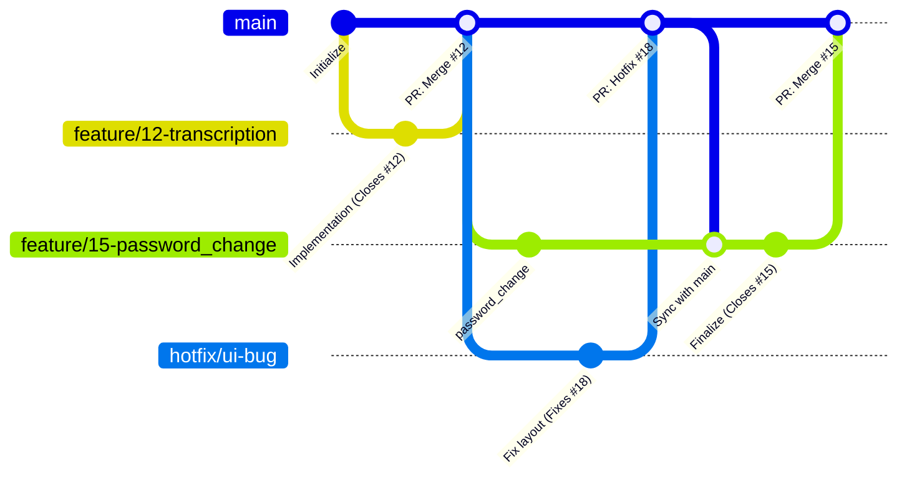

# Development Process

## 1. Workflow and Sprint Management

The team follows an iterative development process organized into one-week sprints. All work must be tracked through the project issue tracker to maintain traceability.

**Work status workflow:**

1. **To Do:** the task is defined, estimated, and prioritized.
2. **Ready:** the task is ready to be implemented.
3. **In Progress:** the task is assigned to a developer and a dedicated feature branch is created.
4. **Review:** development is complete, a Pull Request is opened, automated checks run, and peer review is conducted.
5. **Done:** the task meets the Definition of Done, the branch is merged into `main`, and the issue is closed.

## 2. Definition of Done

A task is considered Done only when it satisfies the requirements in the [Definition of Done](/docs/definition-of-done.md).

## 3. Configuration Management

- **Secrets management:** no secrets, API keys, or credentials may be committed to the repository. Use local environment variables.
- **Environment configuration:** environment-specific settings are documented or handled through configuration files instead of hard-coded application values.
- **Traceability:** configuration changes must be tracked through PRs like source code changes.

## 4. Repository Workflow

- **Branch protection (`main`):**
  - Direct pushes to `main` are prohibited.
  - Changes are accepted only through Pull Requests.
  - Peer approval is required before merging.
  - Required status checks must pass before merge.
- **Traceability semantics:**
  - Branch names should include the issue ID.
  - PR descriptions must contain a closing keyword or another valid issue reference.

## 5. Git Workflow

The team uses a feature branch workflow. The `main` branch is the single source of truth for the stable product version.

- **Feature isolation:** every task starts with a branch linked to an issue ID. This keeps `main` stable.
- **Synchronization:** if a hotfix is merged into `main` while a developer is working on a feature, the developer syncs the feature branch with `main`.
- **Verification:** the PR process ensures code is peer-reviewed and CI tests pass before merge.
