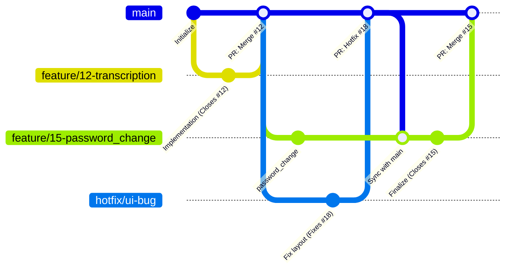

# Development Process

## 1. Workflow and Sprint Management (Process Requirements)

Team follows an iterative development process organized into 1-week sprints. All work must be tracked via the project's Issue Tracker to ensure full traceability

**Work Status Workflow:**
1. **To Do:** Task is defined, estimated, and prioritized
2. **Ready:** The task is ready to be implemented
3. **In Progress:** The task is assigned to a developer; a dedicated feature branch is created
5. **Review:** Code development is complete. A Pull/Merge Request is opened. Automated checks run, and peer reviews are conducted
6. **Done:** The task meets the Definition of Done, the branch is merged into `main`, and the issue is closed

## 2. Definition of Done (DoD)

A task is considered "Done" only when it strictly adheres to the requirements defined in our [Definition of Done](/docs/definition-of-done.md)

## 3. Configuration Management

To maintain security and consistency across environments, the project adheres to the following configuration management rules:
* **Secrets Management:** No secrets, API keys, or credentials must be committed to the repository. Use environment variables locally
* **Environment Configuration:** All environment-specific settings are documented or handled via configuration files, avoiding hard-coded values in the application logic
* **Traceability:** Configuration changes must be tracked via PRs, similar to source code changes

## 4. Repository Workflow

To maintain project stability and code quality, the repository enforces the following rules:

- **Branch Protection (`main`):**
    - Direct pushes to `main` are prohibited
    - Changes are only accepted via Pull Requests
    - Mandatory peer approval is required before merging
    - Status checks (CI/CD pipeline) must pass before the Merge is available
- **Traceability Semantics:**
    - Branch names must include the issue ID
    - PR descriptions must contain closing keywords to automatically link and close issues upon merging

## 5. Git Workflow

We utilize the Feature Branch Workflow. The `main` branch serves as the single source of truth for the stable, production-ready version of the project

### Workflow Visualization

The following diagram illustrates our branching strategy, where developers isolate work in feature branches, sync with `main` to resolve conflicts, and merge only after verification.

### Usage Explanation

- **Feature Isolation:** Every task starts with a  branch linked to an Issue ID. This ensures the `main` branch remains stable
- **Synchronization:** If a hotfix is merged into `main` while a developer is working on a feature, the developer must merge `main` into their feature branch `Sync with main` to ensure the codebase remains compatible
- **Verification:** The PR process ensures that code is peer-reviewed and CI tests pass before the branch is merged into `main`, enforcing the `Definition of Done`
