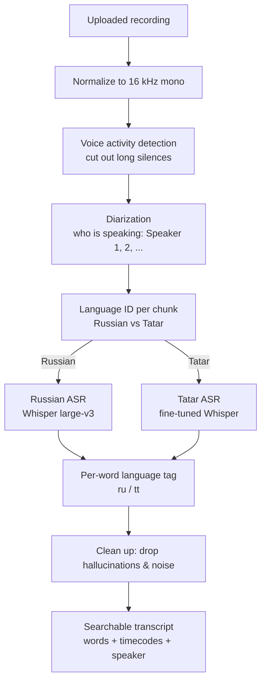

# Improving ASR Accuracy — A Guide for the Customer

**Audience:** the person who owns and uses the corpus (a parent recording a bilingual
Russian/Tatar child). No machine-learning background is assumed.

**What this document answers:**
1. How the speech recognition (ASR) works today, in plain terms.
2. The concrete ways you can make it **more accurate** — from things you can do
   yourself this week, to a full model re-training if you decide to invest in it.
3. How to *measure* that accuracy actually went up, so you are never guessing.

> **The one-sentence version.** Every time you correct a word in the interface, you
> are doing the single most valuable thing for accuracy: you are both fixing that
> recording *and* creating the labelled data that a future, stronger model would be
> trained on. Everything else in this guide builds on that.

---

## 1. How the ASR works today

The system does **not** use a single magic model. An uploaded recording flows through
a short chain of steps, and different steps can be improved independently. Knowing the
chain tells you *which lever fixes which kind of mistake*.



| Step | What it decides | Typical mistake it can make |
|---|---|---|
| Language ID (LID) | Is this stretch Russian or Tatar? | Sends Tatar speech to the Russian model (or vice-versa), which then guesses nonsense |
| Russian ASR (Whisper large-v3) | The Russian words | Very strong; occasional errors on noisy/quiet speech |
| Tatar ASR (fine-tuned Whisper) | The Tatar words | The weakest link — see below |
| Per-word language tag | Colour each word ru/tt | A Tatar word written in Russian letters can be mislabelled |
| Clean-up | Remove "phantom" text | Can occasionally drop a real, very quiet word |

**Why Tatar is the hard part.** High-quality Russian ASR is a solved problem — the
Russian model is huge and trained on enormous amounts of data. Public Tatar models are
far smaller and trained on far less data. Ours is a *fine-tuned Whisper-small*
(`yasalma/whisper-finetuned-tt-asr`): good enough to be genuinely useful, but it still
makes small spelling errors (e.g. *Мина* instead of *Мин*). **Almost all of the
accuracy headroom is on the Tatar side and on the Russian-vs-Tatar routing.** That is
where the levers below are aimed.

---

## 2. Two meanings of "training"

People say "train the ASR" to mean two very different things. Both matter, and they
work best together:

- **A. Teaching the *system* (no ML, do it yourself, starts helping immediately).**
  Correcting transcripts, labelling speakers, and growing the Tatar word list. This
  improves what you see and search *today* and simultaneously builds the dataset that
  (B) needs.
- **B. Re-training the *model* (a real ML project, larger investment).** Fine-tuning
  the Tatar model — or swapping in a stronger one — so it makes fewer mistakes in the
  first place, before you ever touch a transcript.

The honest sequence is: **do (A) consistently for a while, which produces the data,
then (B) becomes possible and worthwhile.** You cannot fine-tune a better Tatar model
out of thin air — it needs verified examples, and *your corrections are exactly those
examples.*

---

## 3. Part A — What you can do yourself (highest value first)

### A1. Correct transcripts in the interface — the everyday lever

The application lets you fix any word: change its spelling, change its language tag
(ru ↔ tt), insert a missing word, or delete a phantom one. When you do this, three
things update together:

1. the transcript you read and play back,
2. the **search index** (so searching now finds the corrected word), and
3. the recording's statistics (word counts, language split).

**Why it is the top lever:** it is the only action that directly produces
*ground-truth* — a verified "the audio here really says X". That is the raw material
for spell-tuning (A4) and for any future model fine-tuning (Part B). Corrections do
**not** silently retrain the model today — they are saved, accurate, and searchable,
and they accumulate into the dataset that makes retraining possible later. Treat every
correction as a small deposit into a training set.

**Practical habit:** correct the recordings you actually search and re-listen to. You
do not need to reach 100% on every file — you need a growing pile of *trustworthy*
Tatar examples.

### A2. Label the speakers (and the child)

Recordings are diarized into anonymous "Speaker 1 / Speaker 2 …". Rename them
(mother / father / child) once and the label sticks across the corpus. This is not
cosmetic:

- it makes speaker-filtered search work ("only the child"), and
- it is a prerequisite for child-focused features (e.g. searching only the child's
  speech), because the child's voice is the hardest for the automatic clustering to
  isolate.

### A3. Grow the Tatar word list — fix the *language colouring*

Some Tatar words are spoken but written with ordinary Russian letters (e.g. *яп*,
*япма*, *малай*, *матур*). The recognizer transcribes the letters fine, but the
per-word **language tag** can wrongly call them Russian. The fix is a simple text file:

- File: `backend/src/data/tatar_wordlist.txt`
- Format: one word per line, lower-case. Lines starting with `#` are comments.
- It is loaded automatically; no code change is needed.

**When you need it:** a word is tagged `ru` but should be `tt`, *and* it is written
only in Russian letters (words containing the Tatar letters ә ө ү җ ң һ are already
tagged `tt` automatically — never add those).

> ⚠️ **The one rule that matters:** never add a word that is also a normal Russian
> word (*бар*, *кит*, *без*, *да*, *юк*…). If you do, every Russian use of that word
> across the whole corpus will be mis-tagged as Tatar. When in doubt, correct the
> individual word in the transcript (A1) instead of adding it to the list.

### A4. Spell-tuning — let corrections repair each other

As the corpus grows, the system can build, offline, two helper tables from **all**
words across **all** recordings:

- a **cumulative vocabulary** (every word actually used, with frequencies and
  language), and
- **confusion candidates**: for each word, the other real corpus words it is most
  likely a mis-recognition of — primarily Russian↔Tatar look-alike letters the Tatar
  model confuses (а↔ә, о↔ө, у↔ү, н↔ң, х↔һ, ж↔җ), plus one-letter edits.

This is what lets a search for a correctly-spelled word also surface the recording
where the model spelled it slightly wrong, without editing the original transcript.
It is rebuilt offline from the current corpus — so **the more you correct (A1), the
sharper this gets.** It is a corpus-driven aid, not a model change.

### A5. Better recordings — the cheapest accuracy of all

ASR is *garbage-in, garbage-out*, and this corpus is deliberately hard (home
recordings, TV in the background, a quiet child). Small recording changes beat any
software tweak:

- **Turn off the TV / radio.** Background *speech* is the worst case: the Russian
  from a TV can hijack a chunk's language routing and make the child's Tatar
  disappear.
- **Get the microphone closer** to the child (1–2 m, not across the room).
- Prefer a **quiet room** and avoid clattering dishes / running water near the mic.
- Longer, natural stretches are fine — the system windows them automatically.

---

## 4. Part B — Re-training the model (the larger investment)

When Part A is no longer enough — the child's Tatar words are still misspelled even
after clean recordings — the remaining ceiling is the Tatar model itself. There are
three levers here, from least to most effort. **Try them in this order.**

### B1. Swap in a stronger existing Tatar model (least effort)

The Tatar model is not hard-wired. It is chosen by one setting:

- Environment variable `TT_ASR_MODEL` (default `yasalma/whisper-finetuned-tt-asr`).

If a larger or better community Tatar Whisper model becomes available, pointing this
setting at it is the entire change — the pipeline around it is unchanged. This is the
first thing to try because it costs nothing but an evaluation run (Section 5). Bigger
Whisper sizes (small → medium/large Tatar fine-tunes) generally spell better.

### B2. Fine-tune the Tatar model on *your* corrected data (the real training)

This is "training the ASR" in the full sense. The recipe:

1. **Assemble a dataset** of `(audio clip, verified transcript)` pairs. This is
   precisely what your corrections in A1 produce: each corrected recording is a set of
   words with timecodes and a trustworthy transcript. Exporting these clips + their
   final text gives you a Tatar training set that matches *your* child's voice,
   accent, and vocabulary — which no public model has ever seen.
2. **Fine-tune** a Whisper Tatar checkpoint on that set (standard Whisper fine-tuning;
   an ML engineer runs this offline on a GPU, typically a few hours). Fine-tuning
   nudges an existing model toward your data rather than training from scratch, so a
   few dozen well-corrected recordings already move the needle.
3. **Publish the resulting model** and point `TT_ASR_MODEL` at it (same one-line swap
   as B1).
4. **Evaluate** (Section 5) to confirm it actually improved before adopting it.

Two things make this realistic rather than aspirational:

- The data is a **by-product of normal use** — you are already creating it every time
  you correct a transcript. The main task is to *keep correcting* and then export.
- Fine-tuning is **incremental**: you can re-fine-tune periodically as the corrected
  corpus grows, each round a little better. It is a habit, not a one-off megaproject.

> **What it takes from you vs. from an engineer.** *You* provide corrected recordings
> (Part A) and decide when there's enough. *An ML engineer* does the export, the
> fine-tuning run, and the evaluation. The clearer and more consistent your
> corrections, the better the resulting model.

### B3. Improve the Russian-vs-Tatar routing (LID)

Even a perfect Tatar model produces nonsense if a chunk of Tatar speech was sent to
the Russian model. On mixed-language home audio this is a real source of errors. The
routing uses a general-purpose language identifier today; it can be upgraded to a
**dedicated Russian/Tatar classifier** and/or run on **shorter chunks** so a Russian
TV sentence and the child's Tatar reply don't get lumped together. This is an ML task
in the same family as B2 (a small classifier trained on ru/tt audio) and is worth
doing once the Tatar model itself is strong.

---

## 5. How to know it actually got better

Never adopt a change on a hunch — this corpus is judged *by listening*. There is an
evaluation harness for exactly this:

```
python scripts/QualityRequirements/transcription_quality_test.py
```

It runs a fixed set of test recordings and reports, per file: how many words, the
ru/tt split, and whether the language tagging is correct. **The discipline that keeps
quality moving up:**

1. Run it **before** a change to get a baseline.
2. Make **one** change (a new model in `TT_ASR_MODEL`, a wordlist edit, a routing
   tweak…).
3. Run it **after**, and compare the same files side by side on: (a) ru/tt tagging
   correctness, (b) spelling readability, (c) no new hallucinations, (d) no words lost
   at chunk boundaries.
4. Keep the change **only if** it clearly and consistently wins — including a final
   check by ear on your own recordings.

If a change helps one file and hurts another, it is not ready. One change at a time,
measured both ways, is what turns "it feels better" into "it is better."

---

## 6. Recommended path (put it together)

A realistic order of operations to raise accuracy over time:

1. **Now:** record cleaner (Section A5) and **correct the transcripts you use**
   (A1) — this is both the immediate win and the seed of everything else.
2. **As you go:** label speakers (A2) and add Russian-letter Tatar words to the
   wordlist when you spot mis-colouring (A3), respecting the one rule.
3. **Periodically:** rebuild spell-tuning (A4) so search tolerates the model's
   remaining spelling slips.
4. **When A plateaus:** try a bigger existing Tatar model via `TT_ASR_MODEL` (B1) and
   evaluate (Section 5).
5. **When you have a solid pile of corrected recordings:** fine-tune the Tatar model
   on them (B2) and, in the same effort, sharpen ru/tt routing (B3).
6. **Always:** measure before and after (Section 5).

---

## 7. FAQ

**Do my corrections retrain the model automatically?**
No. They immediately fix the transcript, the search index, and the statistics, and
they accumulate as the dataset a future fine-tune (B2) uses. Retraining is a separate,
deliberate step an engineer runs — but it is *fed* by your corrections.

**Will the Russian ever get as good as I want without any of this?**
The Russian side is already strong out of the box. The effort in this guide is aimed
at Tatar and at the routing between the two languages — that is where the gains are.

**I added a word to the list and now Russian words are wrong.**
You almost certainly added a word that is also Russian. Remove it from
`tatar_wordlist.txt`; fix those specific words in the transcript instead (A1).

**How much corrected data is "enough" to fine-tune?**
There is no hard threshold — fine-tuning is incremental. Even a few dozen
well-corrected recordings help; more is better. Start when you have a body of Tatar
you trust, evaluate, and repeat.

---

*Related internal documents (for the engineering team):*
`docs/extra/ru_tt_pipeline.md` (the production pipeline in detail),
`docs/extra/storage_and_search.md` (how transcripts and the search index are stored).
