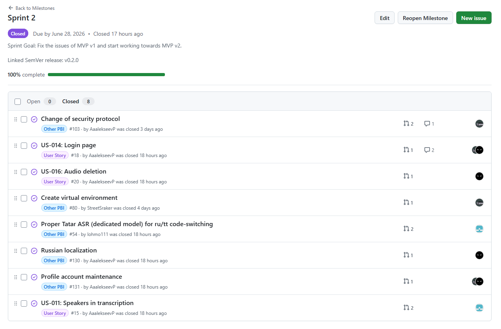
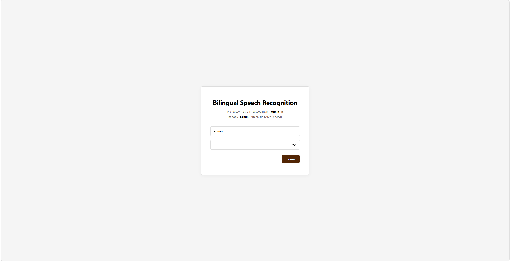
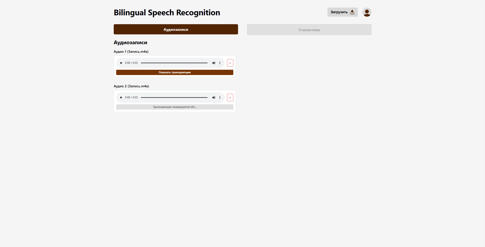
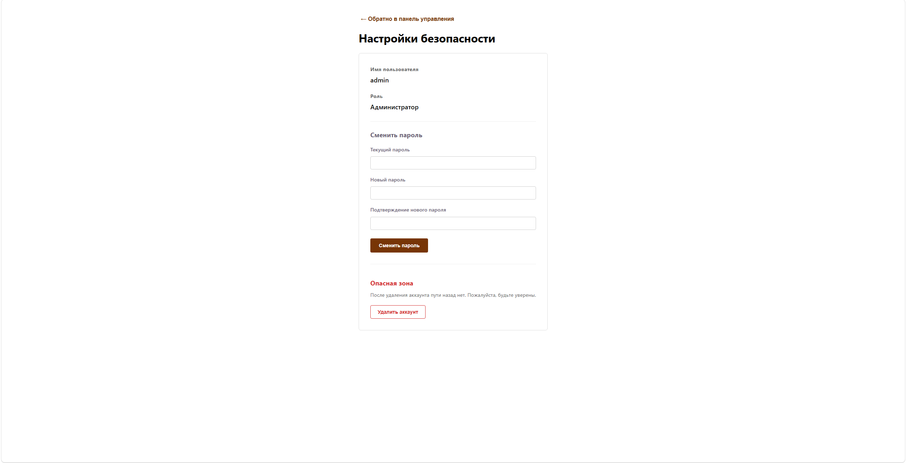
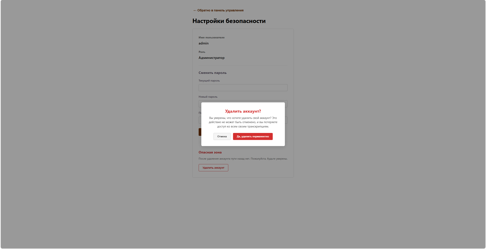

# Assignment 4 – Week 4 Report

## Project Information

### Project Name

Bilingual Speech Recognition

### Project Description

Bilingual Speech Recognition is a web-based application designed to support the transcription and analysis of bilingual Russian–Tatar speech recordings. The system allows users to upload audio files, generate transcriptions, and identify language usage within recordings.

## Product Backlog and Sprint

### Sprint Information

**Sprint Goal:** Fix the issues of MVP v1 and start working towards MVP v2.

**Sprint Dates:** 22.06-28.06

**Sprint Scope Summary:** Improve everything related to trancription, add roles for users to divide their abilities.

**Total Sprint Size:** 20

### Links:

- [Product Backlog board](https://github.com/orgs/SWP-Team20/projects/1/views/7)
- [Sprint Backlog board](https://github.com/orgs/SWP-Team20/projects/1/views/8?sliceBy%5Bvalue%5D=Sprint+2)
- [Sprint milestone](https://github.com/SWP-Team20/Bilingual-speech-recognition/milestone/2)
- [Roadmap](https://github.com/SWP-Team20/Bilingual-speech-recognition/blob/main/docs/roadmap.md)

## Delivered Product

### Customer feedback response table

| Feedback point | Resulting PBI or issue | Status | Response |
|---|---|---|---|
| The customer requested transcription to be more accurate and be in sentences. | https://github.com/SWP-Team20/Bilingual-speech-recognition/issues/54 | Done | Improved speech recognition model, changed transcription output from 'raw' to 'text', allowing sentences to be displayed. |
| The customer asked for the interface to be in Russian. | https://github.com/SWP-Team20/Bilingual-speech-recognition/issues/130 | Done | Localized all English language interface to Russian. |

### Summary of Delivered Product Changes 

Authentification, roles separation, transcription improvement, localization.

### Release

[ADD SEMVER RELEASE SCREENSHOT]

### Product Screenshots

### Links:

- [SemVer Release](...) [INSERT LINK]
- [Changelog](https://github.com/SWP-Team20/Bilingual-speech-recognition/blob/main/CHANGELOG.md)
- [Deployed Product](https://10.93.26.206:5173/)
- [Demo Video of Release](...) [INSERT LINK]
- [Deployment Insctructions](https://github.com/SWP-Team20/Bilingual-speech-recognition/blob/main/docs/deployment.md)
- [LLM Report](https://github.com/SWP-Team20/Bilingual-speech-recognition/blob/main/reports/week4/llm-report.md)

## Testing

### Summary of the quality model used and selected ISO/IEC 25010 sub-characteristics

[INSERT DESCRIPTION]

### Testing status summary

[INSERT DESCRIPTION]

### Perspective of tests in the project

[INSERT DESCRIPTION]

### Latest Protected-Default-Branch CI Run

[ADD LATEST PROTECTED-DEFAULT-BRANCH CI RUN SCREENSHOT]

### Default Branch Protection Evidence

[ADD DEFAULT BRANCH PROTECTION OR RULES SCREENSHOT]

### Coverage or Test Report

[ADD COVERAGE OR TEST REPORT]

### Additional QA Check Result

[ADD ADDITIONAL QA CHECK RESULT SCREENSHOT]

### Links

- [Definition of Done](https://github.com/SWP-Team20/Bilingual-speech-recognition/blob/main/docs/definition-of-done.md)
- [Quality Requirements](https://github.com/SWP-Team20/Bilingual-speech-recognition/blob/main/docs/quality-requirements.md)
- [Quality Requirement Tests Document](https://github.com/SWP-Team20/Bilingual-speech-recognition/blob/main/docs/quality-requirements-tests.md)
- [Testing Document](...) [INSERT LINK]
- [User Acceptance Tests](https://github.com/SWP-Team20/Bilingual-speech-recognition/blob/main/docs/user-acceptance-tests.md)
- [Unit Tests](...) [INSERT LINK]
- [Integration Tests](...) [INSERT LINK]
- [Automated Quality Requirement Tests](...) [INSERT LINK]
- [CI Pipeline](...) [INSERT LINK]
- [Latest Protected-Default-Branch CI Run](...) [INSERT LINK]

## Customer Meeting

### UAT Results Summary

[INSERT DESCRIPTION]

### Links

- [Customer Review Transcript](...) [INSERT LINK]
- [Customer Review Summary](...) [INSERT LINK]

## Product Development Perspectives

### Current Product Status

[INSERT DESCRIPTION]

### Next Steps

[INSERT DESCRIPTION]

### Contribution Traceability Table

| Team Member   | Issues       | PRs          | Reviews      |
| ------------- | ------------ | ------------ | ------------ |
| AaalekseevP | https://github.com/SWP-Team20/Bilingual-speech-recognition/issues/15 https://github.com/SWP-Team20/Bilingual-speech-recognition/issues/18 https://github.com/SWP-Team20/Bilingual-speech-recognition/issues/20 https://github.com/SWP-Team20/Bilingual-speech-recognition/issues/103 https://github.com/SWP-Team20/Bilingual-speech-recognition/issues/104 https://github.com/SWP-Team20/Bilingual-speech-recognition/issues/107 https://github.com/SWP-Team20/Bilingual-speech-recognition/issues/110 https://github.com/SWP-Team20/Bilingual-speech-recognition/issues/113 https://github.com/SWP-Team20/Bilingual-speech-recognition/issues/119 https://github.com/SWP-Team20/Bilingual-speech-recognition/issues/123 https://github.com/SWP-Team20/Bilingual-speech-recognition/issues/130 https://github.com/SWP-Team20/Bilingual-speech-recognition/issues/131 https://github.com/SWP-Team20/Bilingual-speech-recognition/issues/140 https://github.com/SWP-Team20/Bilingual-speech-recognition/issues/143 https://github.com/SWP-Team20/Bilingual-speech-recognition/issues/147 https://github.com/SWP-Team20/Bilingual-speech-recognition/issues/144 https://github.com/SWP-Team20/Bilingual-speech-recognition/issues/152 | https://github.com/SWP-Team20/Bilingual-speech-recognition/pull/105  https://github.com/SWP-Team20/Bilingual-speech-recognition/pull/108 https://github.com/SWP-Team20/Bilingual-speech-recognition/pull/127 https://github.com/SWP-Team20/Bilingual-speech-recognition/pull/129 https://github.com/SWP-Team20/Bilingual-speech-recognition/pull/133 https://github.com/SWP-Team20/Bilingual-speech-recognition/pull/135 https://github.com/SWP-Team20/Bilingual-speech-recognition/pull/139 https://github.com/SWP-Team20/Bilingual-speech-recognition/pull/141 https://github.com/SWP-Team20/Bilingual-speech-recognition/pull/145 https://github.com/SWP-Team20/Bilingual-speech-recognition/pull/153 | https://github.com/SWP-Team20/Bilingual-speech-recognition/pull/109 https://github.com/SWP-Team20/Bilingual-speech-recognition/pull/124 https://github.com/SWP-Team20/Bilingual-speech-recognition/pull/125 https://github.com/SWP-Team20/Bilingual-speech-recognition/pull/126 https://github.com/SWP-Team20/Bilingual-speech-recognition/pull/134 https://github.com/SWP-Team20/Bilingual-speech-recognition/pull/138 https://github.com/SWP-Team20/Bilingual-speech-recognition/pull/142 https://github.com/SWP-Team20/Bilingual-speech-recognition/pull/146 https://github.com/SWP-Team20/Bilingual-speech-recognition/pull/149 https://github.com/SWP-Team20/Bilingual-speech-recognition/pull/150 https://github.com/SWP-Team20/Bilingual-speech-recognition/pull/154 https://github.com/SWP-Team20/Bilingual-speech-recognition/pull/155 https://github.com/SWP-Team20/Bilingual-speech-recognition/pull/156 https://github.com/SWP-Team20/Bilingual-speech-recognition/pull/158 |
| StreetSraker | https://github.com/SWP-Team20/Bilingual-speech-recognition/issues/18 https://github.com/SWP-Team20/Bilingual-speech-recognition/issues/80 https://github.com/SWP-Team20/Bilingual-speech-recognition/issues/88 https://github.com/SWP-Team20/Bilingual-speech-recognition/issues/103 https://github.com/SWP-Team20/Bilingual-speech-recognition/issues/111 https://github.com/SWP-Team20/Bilingual-speech-recognition/issues/115 https://github.com/SWP-Team20/Bilingual-speech-recognition/issues/122 https://github.com/SWP-Team20/Bilingual-speech-recognition/issues/131 https://github.com/SWP-Team20/Bilingual-speech-recognition/issues/143 https://github.com/SWP-Team20/Bilingual-speech-recognition/issues/147 https://github.com/SWP-Team20/Bilingual-speech-recognition/issues/148 | https://github.com/SWP-Team20/Bilingual-speech-recognition/pull/109  https://github.com/SWP-Team20/Bilingual-speech-recognition/pull/124 https://github.com/SWP-Team20/Bilingual-speech-recognition/pull/125 https://github.com/SWP-Team20/Bilingual-speech-recognition/pull/126 https://github.com/SWP-Team20/Bilingual-speech-recognition/pull/134 https://github.com/SWP-Team20/Bilingual-speech-recognition/pull/146 https://github.com/SWP-Team20/Bilingual-speech-recognition/pull/149 https://github.com/SWP-Team20/Bilingual-speech-recognition/pull/150 https://github.com/SWP-Team20/Bilingual-speech-recognition/pull/150 https://github.com/SWP-Team20/Bilingual-speech-recognition/pull/154 https://github.com/SWP-Team20/Bilingual-speech-recognition/pull/155 https://github.com/SWP-Team20/Bilingual-speech-recognition/pull/156 https://github.com/SWP-Team20/Bilingual-speech-recognition/pull/158 | https://github.com/SWP-Team20/Bilingual-speech-recognition/pull/108 https://github.com/SWP-Team20/Bilingual-speech-recognition/pull/127 https://github.com/SWP-Team20/Bilingual-speech-recognition/pull/129 https://github.com/SWP-Team20/Bilingual-speech-recognition/pull/133 https://github.com/SWP-Team20/Bilingual-speech-recognition/pull/135 https://github.com/SWP-Team20/Bilingual-speech-recognition/pull/153 |
| ProPupok | https://github.com/SWP-Team20/Bilingual-speech-recognition/issues/110 https://github.com/SWP-Team20/Bilingual-speech-recognition/issues/111 https://github.com/SWP-Team20/Bilingual-speech-recognition/issues/112 https://github.com/SWP-Team20/Bilingual-speech-recognition/issues/113 https://github.com/SWP-Team20/Bilingual-speech-recognition/issues/114 https://github.com/SWP-Team20/Bilingual-speech-recognition/issues/115 https://github.com/SWP-Team20/Bilingual-speech-recognition/issues/116 https://github.com/SWP-Team20/Bilingual-speech-recognition/issues/117 https://github.com/SWP-Team20/Bilingual-speech-recognition/issues/118 https://github.com/SWP-Team20/Bilingual-speech-recognition/issues/119 https://github.com/SWP-Team20/Bilingual-speech-recognition/issues/120 https://github.com/SWP-Team20/Bilingual-speech-recognition/issues/121 https://github.com/SWP-Team20/Bilingual-speech-recognition/issues/122 https://github.com/SWP-Team20/Bilingual-speech-recognition/issues/123 | https://github.com/SWP-Team20/Bilingual-speech-recognition/pull/138 https://github.com/SWP-Team20/Bilingual-speech-recognition/pull/142 | https://github.com/SWP-Team20/Bilingual-speech-recognition/pull/105 https://github.com/SWP-Team20/Bilingual-speech-recognition/pull/139 https://github.com/SWP-Team20/Bilingual-speech-recognition/pull/141 https://github.com/SWP-Team20/Bilingual-speech-recognition/pull/145 |
| lohmo111 | https://github.com/SWP-Team20/Bilingual-speech-recognition/issues/15 https://github.com/SWP-Team20/Bilingual-speech-recognition/issues/54 | https://github.com/SWP-Team20/Bilingual-speech-recognition/pull/136 | — |
| anakin-shitcoder | https://github.com/SWP-Team20/Bilingual-speech-recognition/issues/120 https://github.com/SWP-Team20/Bilingual-speech-recognition/issues/121 | — | — |

### Example Reviewed Issue-Linked PR

[ADD REVIEWED ISSUE-LINKED PR SCREENSHOT]

### Links

- [Reflection](https://github.com/SWP-Team20/Bilingual-speech-recognition/blob/main/reports/week4/reflection.md)
- [Retrospective](https://github.com/SWP-Team20/Bilingual-speech-recognition/blob/main/reports/week4/retrospective.md)
