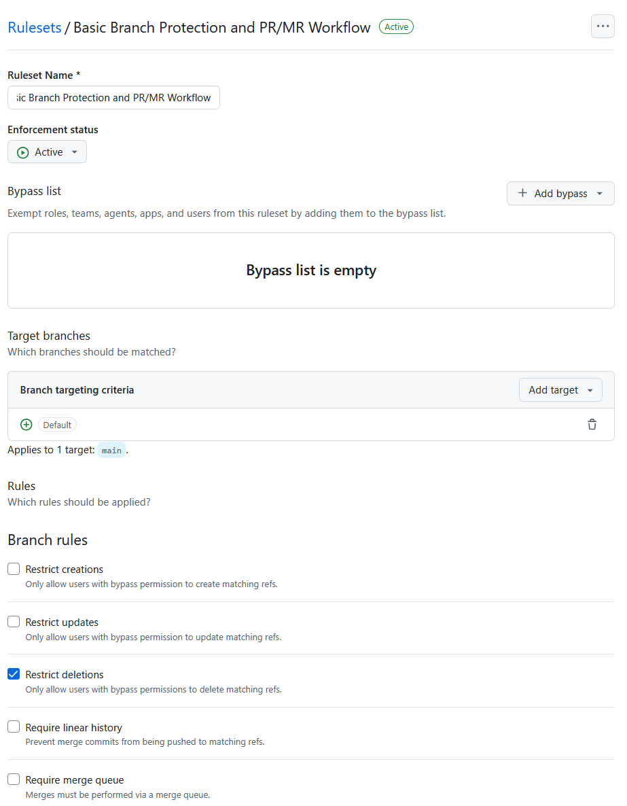
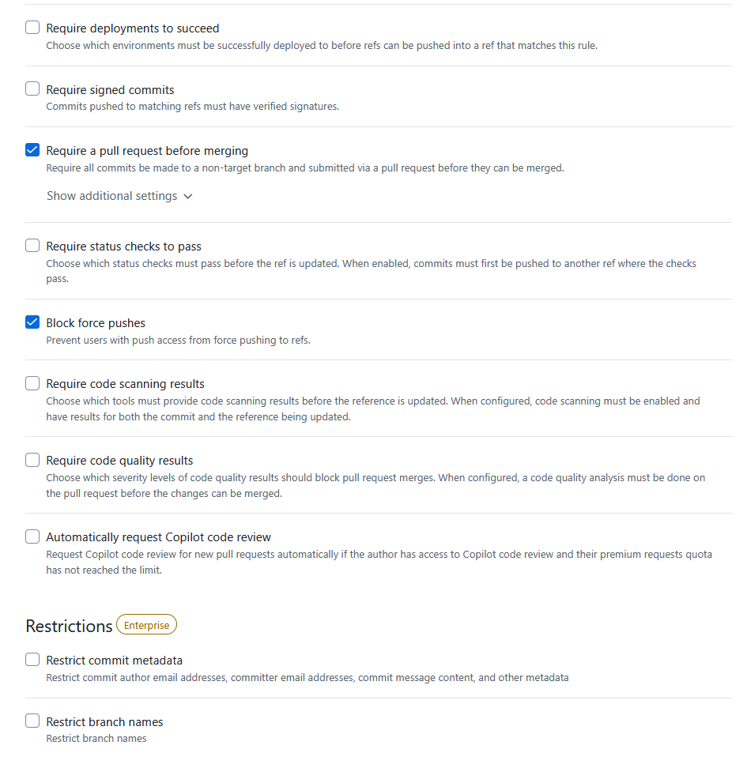
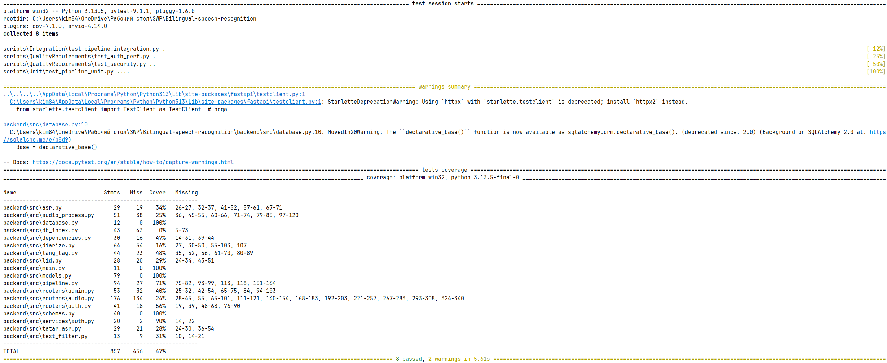
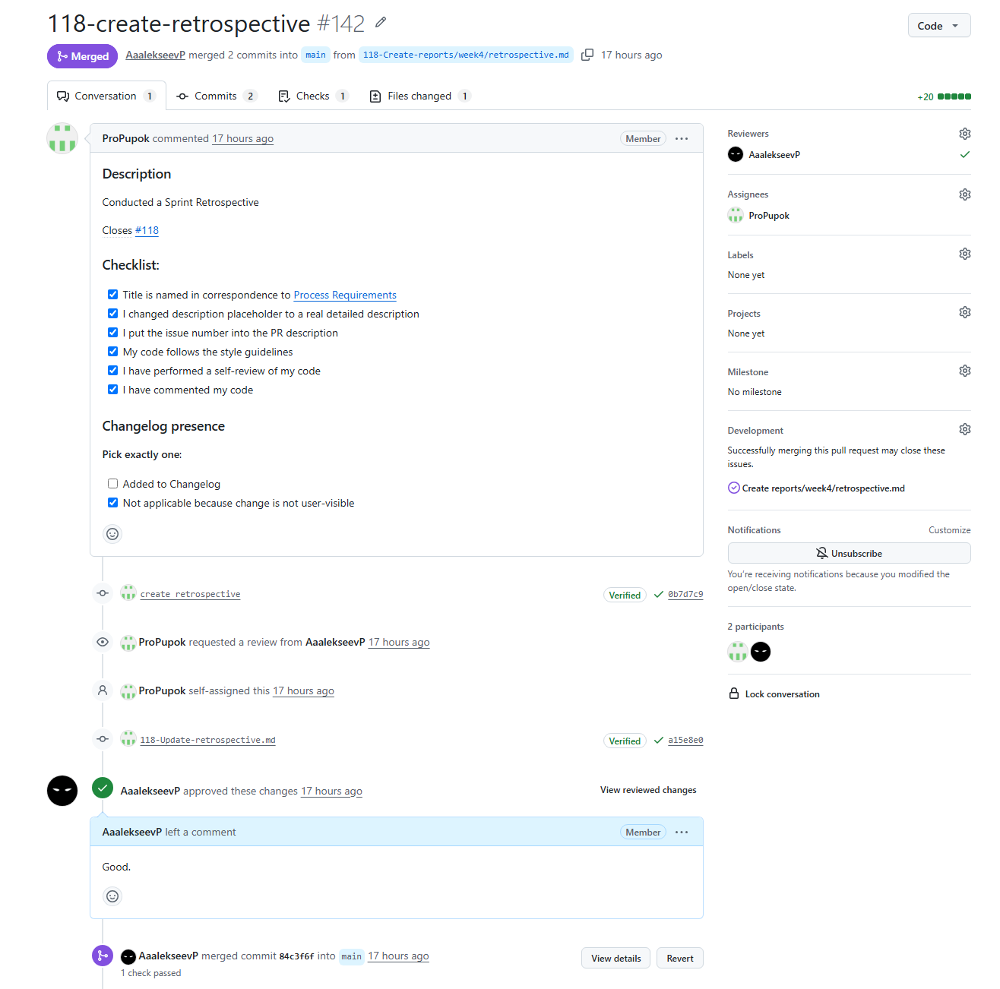

# Assignment 4 – Week 4 Report

----

## Project Information

### Project Name

Bilingual Speech Recognition

### Project Description

Bilingual Speech Recognition is a web-based application designed to support the transcription and analysis of bilingual Russian–Tatar speech recordings. The system allows users to upload audio files, generate transcriptions, and identify language usage within recordings.

---

## Product Backlog and Sprint

### Sprint Information

**Sprint Goal:** Fix the issues of MVP v1 and start working towards MVP v2.

**Sprint Dates:** 22.06-28.06

**Sprint Scope Summary:** Improve everything related to trancription, add roles for users to divide their abilities.

**Total Sprint Size:** 20

### Links:

- [Product Backlog board](https://github.com/orgs/SWP-Team20/projects/1/views/7)
- [Sprint Backlog board](https://github.com/orgs/SWP-Team20/projects/1/views/8?sliceBy%5Bvalue%5D=Sprint+2)
- [Sprint milestone](https://github.com/SWP-Team20/Bilingual-speech-recognition/milestone/2)
- [Roadmap](https://github.com/SWP-Team20/Bilingual-speech-recognition/blob/main/docs/roadmap.md)

---

## Delivered Product

### Customer feedback response table

| Feedback point | Resulting PBI or issue | Status | Response |
|---|---|---|---|
| The customer requested transcription to be more accurate and be in sentences. | https://github.com/SWP-Team20/Bilingual-speech-recognition/issues/54 | Done | Improved speech recognition model, changed transcription output from 'raw' to 'text', allowing sentences to be displayed. |
| The customer asked for the interface to be in Russian. | https://github.com/SWP-Team20/Bilingual-speech-recognition/issues/130 | Done | Localized all English language interface to Russian. |

Feedback not addressed was positive and does not require further PBIs.

### Summary of Delivered Product Changes 

Authentification, roles separation, transcription improvement, localization.

### Release

### Product Screenshots

### Links:

- [SemVer Release](https://github.com/SWP-Team20/Bilingual-speech-recognition/releases/tag/v0.2.0)
- [Changelog](https://github.com/SWP-Team20/Bilingual-speech-recognition/blob/main/CHANGELOG.md)
- [Deployed Product](https://10.93.26.206:5173/)
- [Demo Video of Release](https://drive.google.com/file/d/1gZFVvBlLaDwEhd9c0C7aHtORx1p0k-hW/view?usp=sharing)
- [Access Instructions](https://github.com/SWP-Team20/Bilingual-speech-recognition/blob/main/README.md)
- [Deployment Insctructions](https://github.com/SWP-Team20/Bilingual-speech-recognition/blob/main/docs/deployment.md)
- [LLM Report](https://github.com/SWP-Team20/Bilingual-speech-recognition/blob/main/reports/week4/llm-report.md)

---

## Testing

### Summary of the quality model used and selected ISO/IEC 25010 sub-characteristics

* **Confidentiality:** Enforced by validating that data stores and direct endpoints containing protected user audio binary files strictly reject unauthenticated actions.
* **Maintainability:** Enforced by applying static analyses, structural format consistency rules, automated line coverage limits, and strict Pull Request template compliance verification before code integrations.

### Testing status summary

All the tests for critical modules were passed.

Per-module coverage line status:

- `backend/src/pipeline.py`: 71%
- `backend/src/text_filter.py`: 31%
- `backend/src/services/auth.py`: 90%
- `backend/src/routers/auth.py`: 56%

The backend tests, achieved a coverage of **47%**. Static syntax quality and platform package vulnerability baselines are continuously verified for both stacks. Manual system validations ensure smooth end-to-end client token caching and file ingestion flows.

### Perspective of tests in the project

We will still work on speech recognition, which means there will be some changes in these modules: `pipeline.py`, `text_filter.py`, `services/auth.py`, `routers/auth.py`. These tests will help to maintain further development.

### Latest Protected-Default-Branch CI Run (right before uploading this README)

### Default Branch Protection Evidence

### Coverage or Test Report

Critical modules (`pipeline.py`, `text_filter.py`, `services/auth.py`, `routers/auth.py`) all have 30+% coverage.

### Additional QA Check Result

Platform dependency manifests are dynamically checked against current security vulnerability directories.

### Links

- [Definition of Done](https://github.com/SWP-Team20/Bilingual-speech-recognition/blob/main/docs/definition-of-done.md)
- [Quality Requirements](https://github.com/SWP-Team20/Bilingual-speech-recognition/blob/main/docs/quality-requirements.md)
- [Quality Requirement Tests Document](https://github.com/SWP-Team20/Bilingual-speech-recognition/blob/main/docs/quality-requirements-tests.md)
- [Testing Document](https://github.com/SWP-Team20/Bilingual-speech-recognition/blob/main/docs/testing.md)
- [User Acceptance Tests](https://github.com/SWP-Team20/Bilingual-speech-recognition/blob/main/docs/user-acceptance-tests.md)
- [Unit Tests](https://github.com/SWP-Team20/Bilingual-speech-recognition/blob/main/scripts/Unit)
- [Integration Tests](https://github.com/SWP-Team20/Bilingual-speech-recognition/blob/main/scripts/Integration)
- [Automated Quality Requirement Tests](https://github.com/SWP-Team20/Bilingual-speech-recognition/blob/main/scripts/QualityRequirements)
- [CI Pipeline](https://github.com/SWP-Team20/Bilingual-speech-recognition/blob/main/.github/workflows/quality-requirements-tests.yml)
- [Latest Protected-Default-Branch CI Run](https://github.com/SWP-Team20/Bilingual-speech-recognition/actions/runs/28303050638)

---

## Customer Meeting

### UAT Results Summary

As client could not have get access to product, as they were not connected to university network, UAT were conducted on one of the team members' computer with guidance of client.

Three scenario were presented:

- Getting and verifying audio transcription,
- Deleting an audio,
- Changing the password to secure profile.

All three passed and marked by client as successful.

### Links

- [Customer Review Transcript](https://github.com/SWP-Team20/Bilingual-speech-recognition/blob/main/reports/week4/customer-review-transcript.md)
- [Customer Review Summary](https://github.com/SWP-Team20/Bilingual-speech-recognition/blob/main/reports/week4/customer-review-summary.md)

---

## Product Development Perspectives

### Current Product Status

Project contains all core function excluding filtering and statistics information. Product works well, all tests are passed and client is satisfied. Development speed increased, as in comparison to the previous week.

### Next Steps

- Wait for source audio file from KFU and train model by it;
- Start working on filtering and audio modifications;
- Plan statistics, present visuals.

### Contribution Traceability Table

| Team Member   | Issues       | PRs          | Reviews      |
| ------------- | ------------ | ------------ | ------------ |
| AaalekseevP | https://github.com/SWP-Team20/Bilingual-speech-recognition/issues/15 https://github.com/SWP-Team20/Bilingual-speech-recognition/issues/18 https://github.com/SWP-Team20/Bilingual-speech-recognition/issues/20 https://github.com/SWP-Team20/Bilingual-speech-recognition/issues/103 https://github.com/SWP-Team20/Bilingual-speech-recognition/issues/104 https://github.com/SWP-Team20/Bilingual-speech-recognition/issues/107 https://github.com/SWP-Team20/Bilingual-speech-recognition/issues/110 https://github.com/SWP-Team20/Bilingual-speech-recognition/issues/113 https://github.com/SWP-Team20/Bilingual-speech-recognition/issues/119 https://github.com/SWP-Team20/Bilingual-speech-recognition/issues/120 https://github.com/SWP-Team20/Bilingual-speech-recognition/issues/123 https://github.com/SWP-Team20/Bilingual-speech-recognition/issues/130 https://github.com/SWP-Team20/Bilingual-speech-recognition/issues/131 https://github.com/SWP-Team20/Bilingual-speech-recognition/issues/140 https://github.com/SWP-Team20/Bilingual-speech-recognition/issues/143 https://github.com/SWP-Team20/Bilingual-speech-recognition/issues/147 https://github.com/SWP-Team20/Bilingual-speech-recognition/issues/144 https://github.com/SWP-Team20/Bilingual-speech-recognition/issues/152 https://github.com/SWP-Team20/Bilingual-speech-recognition/issues/165 | https://github.com/SWP-Team20/Bilingual-speech-recognition/pull/105  https://github.com/SWP-Team20/Bilingual-speech-recognition/pull/108 https://github.com/SWP-Team20/Bilingual-speech-recognition/pull/127 https://github.com/SWP-Team20/Bilingual-speech-recognition/pull/129 https://github.com/SWP-Team20/Bilingual-speech-recognition/pull/133 https://github.com/SWP-Team20/Bilingual-speech-recognition/pull/135 https://github.com/SWP-Team20/Bilingual-speech-recognition/pull/139 https://github.com/SWP-Team20/Bilingual-speech-recognition/pull/141 https://github.com/SWP-Team20/Bilingual-speech-recognition/pull/145 https://github.com/SWP-Team20/Bilingual-speech-recognition/pull/153 https://github.com/SWP-Team20/Bilingual-speech-recognition/pull/160 https://github.com/SWP-Team20/Bilingual-speech-recognition/pull/162 https://github.com/SWP-Team20/Bilingual-speech-recognition/pull/163 https://github.com/SWP-Team20/Bilingual-speech-recognition/pull/166 https://github.com/SWP-Team20/Bilingual-speech-recognition/pull/167 https://github.com/SWP-Team20/Bilingual-speech-recognition/pull/169 https://github.com/SWP-Team20/Bilingual-speech-recognition/pull/170 | https://github.com/SWP-Team20/Bilingual-speech-recognition/pull/109 https://github.com/SWP-Team20/Bilingual-speech-recognition/pull/124 https://github.com/SWP-Team20/Bilingual-speech-recognition/pull/125 https://github.com/SWP-Team20/Bilingual-speech-recognition/pull/126 https://github.com/SWP-Team20/Bilingual-speech-recognition/pull/134 https://github.com/SWP-Team20/Bilingual-speech-recognition/pull/138 https://github.com/SWP-Team20/Bilingual-speech-recognition/pull/142 https://github.com/SWP-Team20/Bilingual-speech-recognition/pull/146 https://github.com/SWP-Team20/Bilingual-speech-recognition/pull/149 https://github.com/SWP-Team20/Bilingual-speech-recognition/pull/150 https://github.com/SWP-Team20/Bilingual-speech-recognition/pull/154 https://github.com/SWP-Team20/Bilingual-speech-recognition/pull/155 https://github.com/SWP-Team20/Bilingual-speech-recognition/pull/156 https://github.com/SWP-Team20/Bilingual-speech-recognition/pull/158 https://github.com/SWP-Team20/Bilingual-speech-recognition/pull/159 https://github.com/SWP-Team20/Bilingual-speech-recognition/pull/168 |
| StreetSraker | https://github.com/SWP-Team20/Bilingual-speech-recognition/issues/18 https://github.com/SWP-Team20/Bilingual-speech-recognition/issues/80 https://github.com/SWP-Team20/Bilingual-speech-recognition/issues/88 https://github.com/SWP-Team20/Bilingual-speech-recognition/issues/103 https://github.com/SWP-Team20/Bilingual-speech-recognition/issues/111 https://github.com/SWP-Team20/Bilingual-speech-recognition/issues/115 https://github.com/SWP-Team20/Bilingual-speech-recognition/issues/122 https://github.com/SWP-Team20/Bilingual-speech-recognition/issues/131 https://github.com/SWP-Team20/Bilingual-speech-recognition/issues/143 https://github.com/SWP-Team20/Bilingual-speech-recognition/issues/147 https://github.com/SWP-Team20/Bilingual-speech-recognition/issues/148 https://github.com/SWP-Team20/Bilingual-speech-recognition/issues/157 | https://github.com/SWP-Team20/Bilingual-speech-recognition/pull/109  https://github.com/SWP-Team20/Bilingual-speech-recognition/pull/124 https://github.com/SWP-Team20/Bilingual-speech-recognition/pull/125 https://github.com/SWP-Team20/Bilingual-speech-recognition/pull/126 https://github.com/SWP-Team20/Bilingual-speech-recognition/pull/134 https://github.com/SWP-Team20/Bilingual-speech-recognition/pull/146 https://github.com/SWP-Team20/Bilingual-speech-recognition/pull/149 https://github.com/SWP-Team20/Bilingual-speech-recognition/pull/150 https://github.com/SWP-Team20/Bilingual-speech-recognition/pull/150 https://github.com/SWP-Team20/Bilingual-speech-recognition/pull/154 https://github.com/SWP-Team20/Bilingual-speech-recognition/pull/155 https://github.com/SWP-Team20/Bilingual-speech-recognition/pull/156 https://github.com/SWP-Team20/Bilingual-speech-recognition/pull/158 https://github.com/SWP-Team20/Bilingual-speech-recognition/pull/168 | https://github.com/SWP-Team20/Bilingual-speech-recognition/pull/108 https://github.com/SWP-Team20/Bilingual-speech-recognition/pull/127 https://github.com/SWP-Team20/Bilingual-speech-recognition/pull/129 https://github.com/SWP-Team20/Bilingual-speech-recognition/pull/133 https://github.com/SWP-Team20/Bilingual-speech-recognition/pull/135 https://github.com/SWP-Team20/Bilingual-speech-recognition/pull/153 https://github.com/SWP-Team20/Bilingual-speech-recognition/pull/160 https://github.com/SWP-Team20/Bilingual-speech-recognition/pull/162 https://github.com/SWP-Team20/Bilingual-speech-recognition/pull/163 https://github.com/SWP-Team20/Bilingual-speech-recognition/pull/167 https://github.com/SWP-Team20/Bilingual-speech-recognition/pull/169 https://github.com/SWP-Team20/Bilingual-speech-recognition/pull/170 |
| ProPupok | https://github.com/SWP-Team20/Bilingual-speech-recognition/issues/110 https://github.com/SWP-Team20/Bilingual-speech-recognition/issues/111 https://github.com/SWP-Team20/Bilingual-speech-recognition/issues/112 https://github.com/SWP-Team20/Bilingual-speech-recognition/issues/113 https://github.com/SWP-Team20/Bilingual-speech-recognition/issues/114 https://github.com/SWP-Team20/Bilingual-speech-recognition/issues/115 https://github.com/SWP-Team20/Bilingual-speech-recognition/issues/116 https://github.com/SWP-Team20/Bilingual-speech-recognition/issues/117 https://github.com/SWP-Team20/Bilingual-speech-recognition/issues/118 https://github.com/SWP-Team20/Bilingual-speech-recognition/issues/119 https://github.com/SWP-Team20/Bilingual-speech-recognition/issues/120 https://github.com/SWP-Team20/Bilingual-speech-recognition/issues/121 https://github.com/SWP-Team20/Bilingual-speech-recognition/issues/122 https://github.com/SWP-Team20/Bilingual-speech-recognition/issues/123 | https://github.com/SWP-Team20/Bilingual-speech-recognition/pull/138 https://github.com/SWP-Team20/Bilingual-speech-recognition/pull/142 | https://github.com/SWP-Team20/Bilingual-speech-recognition/pull/105 https://github.com/SWP-Team20/Bilingual-speech-recognition/pull/139 https://github.com/SWP-Team20/Bilingual-speech-recognition/pull/141 https://github.com/SWP-Team20/Bilingual-speech-recognition/pull/145 |
| lohmo111 | https://github.com/SWP-Team20/Bilingual-speech-recognition/issues/15 https://github.com/SWP-Team20/Bilingual-speech-recognition/issues/54 | https://github.com/SWP-Team20/Bilingual-speech-recognition/pull/136 | — |
| anakin-shitcoder | https://github.com/SWP-Team20/Bilingual-speech-recognition/issues/120 | https://github.com/SWP-Team20/Bilingual-speech-recognition/pull/159 | — |

### Example Reviewed Issue-Linked PR

### Links

- [Reflection](https://github.com/SWP-Team20/Bilingual-speech-recognition/blob/main/reports/week4/reflection.md)
- [Retrospective](https://github.com/SWP-Team20/Bilingual-speech-recognition/blob/main/reports/week4/retrospective.md)
