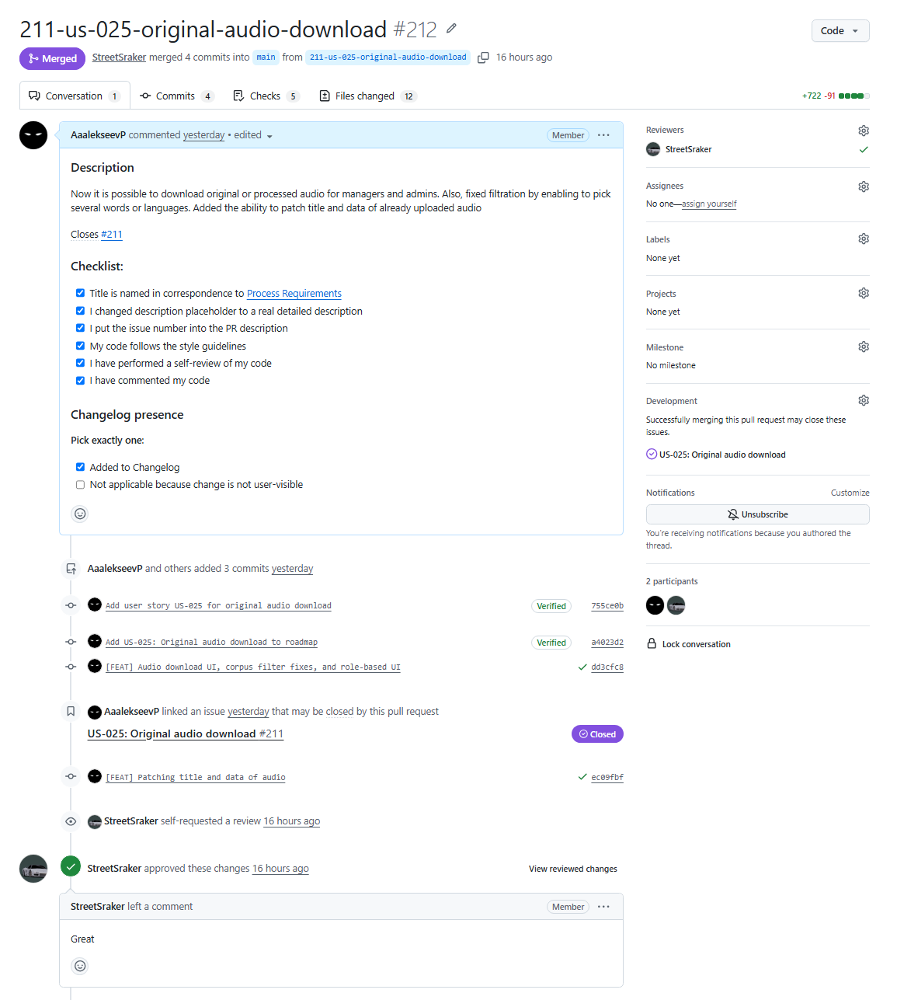
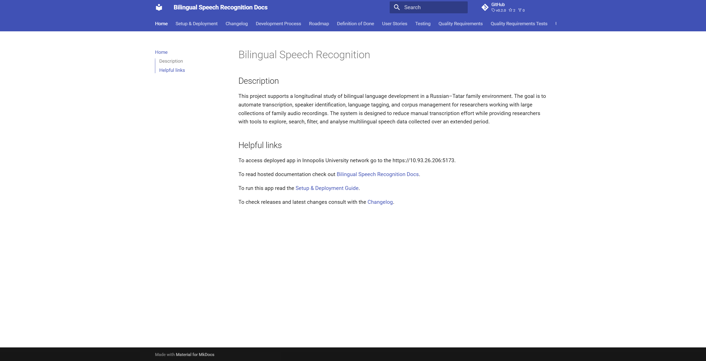
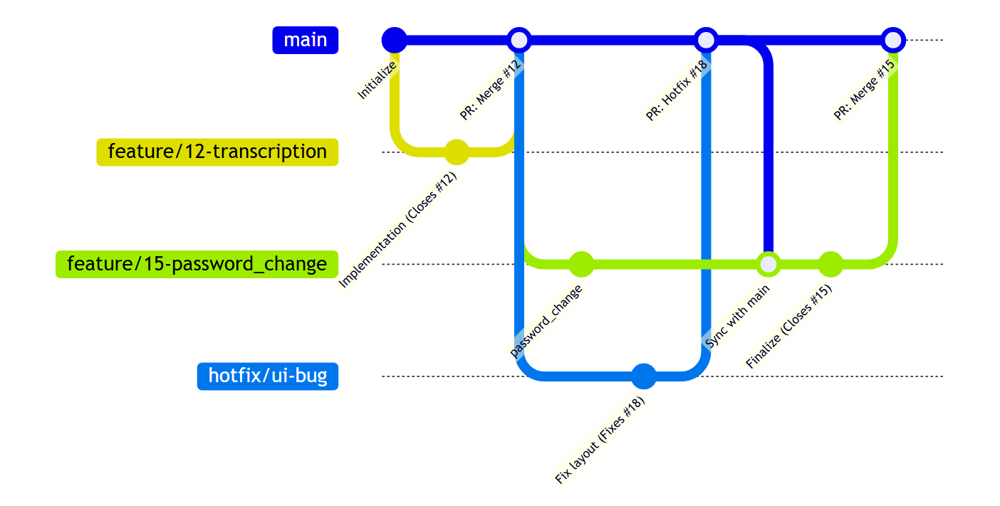

# Assignment 4 – Week 4 Report

----

## Project Information

### Project Name

Bilingual Speech Recognition

### Project Description

Bilingual Speech Recognition is a web-based application designed to support the transcription and analysis of bilingual Russian–Tatar speech recordings. The system allows users to upload audio files, generate transcriptions, and identify language usage within recordings.

---

## Product Backlog and Sprint

### Sprint Information

**Sprint Goal:** Implement and Verify MVP v2.

**Sprint Dates:** 29.06-05.07

**Sprint Scope Summary:** All core and additional features related to audio page is finished, statistics remained.

**Total Sprint Size:** 19

 [INSERT SCREENSHOT]

### Links:

- [Product Backlog Board](https://github.com/orgs/SWP-Team20/projects/1/views/7)
- [Sprint Backlog Board](https://github.com/orgs/SWP-Team20/projects/1/views/8?sliceBy%5Bvalue%5D=Sprint+3)
- [Sprint Milestone](https://github.com/SWP-Team20/Bilingual-speech-recognition/milestone/3)
- [Roadmap](/docs/roadmap.md)

---

## Delivered Product

### Customer Feedback Response Table

| Feedback point | Resulting PBI or issue | Status | Response |
|---|---|---|---|
| Corpus manager design appears too formal | https://github.com/SWP-Team20/Bilingual-speech-recognition/issues/161 | In Progress | — |
| Size of audio (with transcription) in the storage shall be visible near that audio in the list | https://github.com/SWP-Team20/Bilingual-speech-recognition/issues/164 | In Progress | — |

Feedback not addressed:
- Customizable audio tags, such as title or date are necessary — already exists task in https://github.com/SWP-Team20/Bilingual-speech-recognition/issues/106,
- Positive feedback, not resulting in any PBI.

### Summary of Delivered MVP v2 Changes

[INSERT DESCRIPTION]

### Release

 [INSERT SCREENSHOT]

### Product Screenshots

 [INSERT SCREENSHOT]

 [INSERT SCREENSHOT]

 [INSERT SCREENSHOT]

### Links:

- [SemVer Release](...) [INSERT LINK]
- [Changelog](/CHANGELOG.md)
- [Deployed Product](https://10.93.26.206:5173)
- [Demo Video of Release](...) [INSERT LINK]
- [Access Instructions](/README.md)
- [Deployment Insctructions](/deployment.md)
- [LLM Report](...) [INSERT LINK]

---

## Testing

### Testing and CI Status Summary

[INSERT DESCRIPTION]

### Latest Protected-Default-Branch CI Run (right before uploading this README)

 [INSERT SCREENSHOT]

### Links

- [Definition of Done](/docs/definition-of-done.md)
- [Quality Requirements](/docs/quality-requirements.md)
- [Quality Requirement Tests Artifact](/docs/quality-requirements-tests.md)
- [Testing Artifact](/docs/testing.md)
- [User Acceptance Tests](/docs/user-acceptance-tests.md)
- [CI Pipeline](/.github/workflows/quality-requirements-tests.yml)
- [Latest Protected-Default-Branch CI Run](...) [INSERT LINK]

---

## Architecture

### Summary of the Architecture

The system follows a modular client-server architecture designed for Bilingual Speech Recognition. The frontend application interacts with a backend API that operates audio processing, user authentication, and secure media storage. The infrastructure relies on centralized authorization middleware using JSON Web Tokens (JWT) to secure endpoints. The development and deployment lifecycle is supported by a strict CI/CD pipeline integrated via GitHub Actions, which automates static analysis, application builds, and integration testing to maintain repository health.

### How It Supports the Current Product

Architecture directly supports the objectives of MVP v2 by prioritizing stability, security, and traceability. The decoupled nature of the frontend and backend allows for parallel development across the team. The implementation of strict CI/CD gates prevents broken builds from reaching the production branch, reducing integration bugs. Furthermore, the centralized JWT authorization mechanism ensures that the core product assets - audio files are delivered securely.

### How Quality Requirements Are Linked to the Architecture Decisions

Every major structural choice is documented in Architecture Decision Records and explicitly mapped to measurable Quality Requirements. ADR-001 mandates backend JWT validation to directly satisfy the confidentiality constraints of QR-001. ADR-002 enforces automated CI pipeline checks to ensure repository health, fulfilling QR-002. ADR-003 automates metadata parsing for PRs to meet the maintainability and traceability standards of QR-003. These architectural constraints are continuously verified in the pipeline using automated Quality Requirement Tests.

### Links

- [Architecture Artifact](/docs/architecture/README.md)
- [Static View](/docs/architecture/static-view/static.md)
- [Dynamic View](/docs/architecture/dynamic-view/dynamic.md)
- [Deployment View](/docs/architecture/deployment-view/deployment.md)
- [ADR Directory](/docs/architecture/adr)

---

## Customer Meeting

### UAT Results Summary

[INSERT DESCRIPTION]

### Links

- [Customer Review Transcript](...) [INSERT LINK]
- [Customer Review Summary](...) [INSERT LINK]

---

## Product Development Perspectives

### Current Product Status

[INSERT DESCRIPTION]

### Next Steps

[INSERT DESCRIPTION]

### Contribution Traceability Table

| Team Member   | Issues       | PRs          | Reviews      |
| ------------- | ------------ | ------------ | ------------ |
| AaalekseevP | https://github.com/SWP-Team20/Bilingual-speech-recognition/issues/6 https://github.com/SWP-Team20/Bilingual-speech-recognition/issues/16 https://github.com/SWP-Team20/Bilingual-speech-recognition/issues/17 https://github.com/SWP-Team20/Bilingual-speech-recognition/issues/106 https://github.com/SWP-Team20/Bilingual-speech-recognition/issues/132 https://github.com/SWP-Team20/Bilingual-speech-recognition/issues/161 https://github.com/SWP-Team20/Bilingual-speech-recognition/issues/164 https://github.com/SWP-Team20/Bilingual-speech-recognition/issues/171 https://github.com/SWP-Team20/Bilingual-speech-recognition/issues/173 https://github.com/SWP-Team20/Bilingual-speech-recognition/issues/176 https://github.com/SWP-Team20/Bilingual-speech-recognition/issues/192 https://github.com/SWP-Team20/Bilingual-speech-recognition/issues/198 https://github.com/SWP-Team20/Bilingual-speech-recognition/issues/200 https://github.com/SWP-Team20/Bilingual-speech-recognition/issues/201 https://github.com/SWP-Team20/Bilingual-speech-recognition/issues/203 https://github.com/SWP-Team20/Bilingual-speech-recognition/issues/209 https://github.com/SWP-Team20/Bilingual-speech-recognition/issues/211 https://github.com/SWP-Team20/Bilingual-speech-recognition/issues/223 https://github.com/SWP-Team20/Bilingual-speech-recognition/issues/229 | https://github.com/SWP-Team20/Bilingual-speech-recognition/pull/172 https://github.com/SWP-Team20/Bilingual-speech-recognition/pull/174 https://github.com/SWP-Team20/Bilingual-speech-recognition/pull/177 https://github.com/SWP-Team20/Bilingual-speech-recognition/pull/193 https://github.com/SWP-Team20/Bilingual-speech-recognition/pull/202 https://github.com/SWP-Team20/Bilingual-speech-recognition/pull/204 https://github.com/SWP-Team20/Bilingual-speech-recognition/pull/205 https://github.com/SWP-Team20/Bilingual-speech-recognition/pull/206 https://github.com/SWP-Team20/Bilingual-speech-recognition/pull/208 https://github.com/SWP-Team20/Bilingual-speech-recognition/pull/210 https://github.com/SWP-Team20/Bilingual-speech-recognition/pull/212 https://github.com/SWP-Team20/Bilingual-speech-recognition/pull/215 https://github.com/SWP-Team20/Bilingual-speech-recognition/pull/216 https://github.com/SWP-Team20/Bilingual-speech-recognition/pull/224 https://github.com/SWP-Team20/Bilingual-speech-recognition/pull/228 https://github.com/SWP-Team20/Bilingual-speech-recognition/pull/230 | https://github.com/SWP-Team20/Bilingual-speech-recognition/pull/195 https://github.com/SWP-Team20/Bilingual-speech-recognition/pull/196 https://github.com/SWP-Team20/Bilingual-speech-recognition/pull/197 https://github.com/SWP-Team20/Bilingual-speech-recognition/pull/213 https://github.com/SWP-Team20/Bilingual-speech-recognition/pull/217 https://github.com/SWP-Team20/Bilingual-speech-recognition/pull/222 https://github.com/SWP-Team20/Bilingual-speech-recognition/pull/226 https://github.com/SWP-Team20/Bilingual-speech-recognition/pull/227 https://github.com/SWP-Team20/Bilingual-speech-recognition/pull/231 https://github.com/SWP-Team20/Bilingual-speech-recognition/pull/232 |
| StreetSraker | https://github.com/SWP-Team20/Bilingual-speech-recognition/issues/6 https://github.com/SWP-Team20/Bilingual-speech-recognition/issues/16 https://github.com/SWP-Team20/Bilingual-speech-recognition/issues/17 https://github.com/SWP-Team20/Bilingual-speech-recognition/issues/106 https://github.com/SWP-Team20/Bilingual-speech-recognition/issues/132 https://github.com/SWP-Team20/Bilingual-speech-recognition/issues/164 https://github.com/SWP-Team20/Bilingual-speech-recognition/issues/194 https://github.com/SWP-Team20/Bilingual-speech-recognition/issues/198 https://github.com/SWP-Team20/Bilingual-speech-recognition/issues/200 https://github.com/SWP-Team20/Bilingual-speech-recognition/issues/201 | https://github.com/SWP-Team20/Bilingual-speech-recognition/pull/195 https://github.com/SWP-Team20/Bilingual-speech-recognition/pull/196 https://github.com/SWP-Team20/Bilingual-speech-recognition/pull/197 https://github.com/SWP-Team20/Bilingual-speech-recognition/pull/213 | https://github.com/SWP-Team20/Bilingual-speech-recognition/pull/172 https://github.com/SWP-Team20/Bilingual-speech-recognition/pull/174 https://github.com/SWP-Team20/Bilingual-speech-recognition/pull/177 https://github.com/SWP-Team20/Bilingual-speech-recognition/pull/193 https://github.com/SWP-Team20/Bilingual-speech-recognition/pull/202 https://github.com/SWP-Team20/Bilingual-speech-recognition/pull/204 https://github.com/SWP-Team20/Bilingual-speech-recognition/pull/208 https://github.com/SWP-Team20/Bilingual-speech-recognition/pull/210 https://github.com/SWP-Team20/Bilingual-speech-recognition/pull/212 https://github.com/SWP-Team20/Bilingual-speech-recognition/pull/218 https://github.com/SWP-Team20/Bilingual-speech-recognition/pull/219 https://github.com/SWP-Team20/Bilingual-speech-recognition/pull/220 |
| ProPupok | https://github.com/SWP-Team20/Bilingual-speech-recognition/issues/178 https://github.com/SWP-Team20/Bilingual-speech-recognition/issues/186 https://github.com/SWP-Team20/Bilingual-speech-recognition/issues/189 https://github.com/SWP-Team20/Bilingual-speech-recognition/issues/221 https://github.com/SWP-Team20/Bilingual-speech-recognition/issues/225 | https://github.com/SWP-Team20/Bilingual-speech-recognition/pull/217 https://github.com/SWP-Team20/Bilingual-speech-recognition/pull/218 https://github.com/SWP-Team20/Bilingual-speech-recognition/pull/219 https://github.com/SWP-Team20/Bilingual-speech-recognition/pull/220 https://github.com/SWP-Team20/Bilingual-speech-recognition/pull/222 https://github.com/SWP-Team20/Bilingual-speech-recognition/pull/226 https://github.com/SWP-Team20/Bilingual-speech-recognition/pull/227 https://github.com/SWP-Team20/Bilingual-speech-recognition/pull/231 https://github.com/SWP-Team20/Bilingual-speech-recognition/pull/232 | https://github.com/SWP-Team20/Bilingual-speech-recognition/pull/224 https://github.com/SWP-Team20/Bilingual-speech-recognition/pull/228 https://github.com/SWP-Team20/Bilingual-speech-recognition/pull/230 |
| lohmo111 | — | — | — |
| anakin-shitcoder | — | — | — |

### Example Reviewed Issue-Linked PR

### Hosted Documentation Site

### Project Workflow View

### Links

- [Hosted Documentation Site](https://swp-team20.github.io/Bilingual-speech-recognition)
- [Development Process](/docs/development-process.md)
- [Reflection](...) [INSERT LINK]
- [Retrospective](...) [INSERT LINK]
