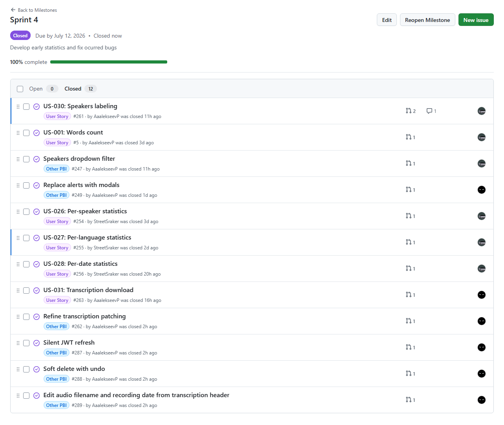
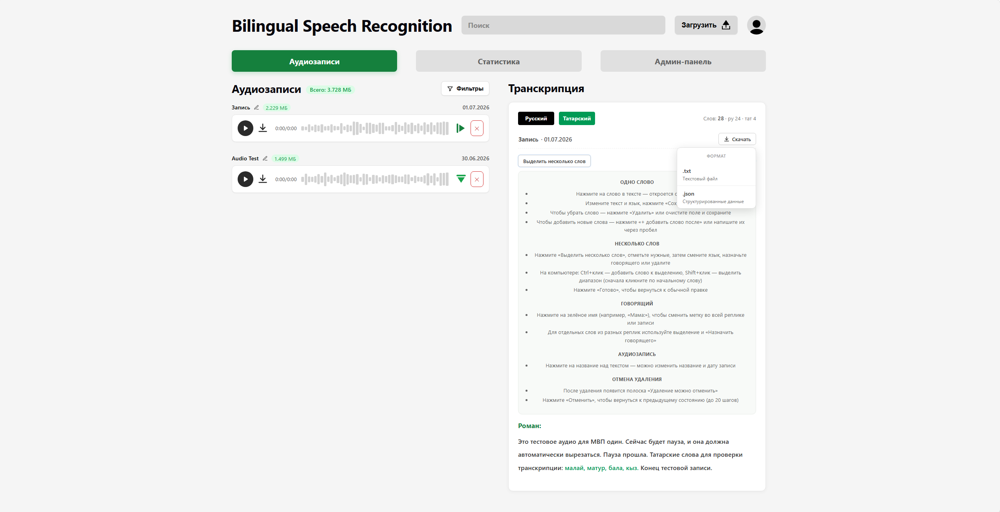
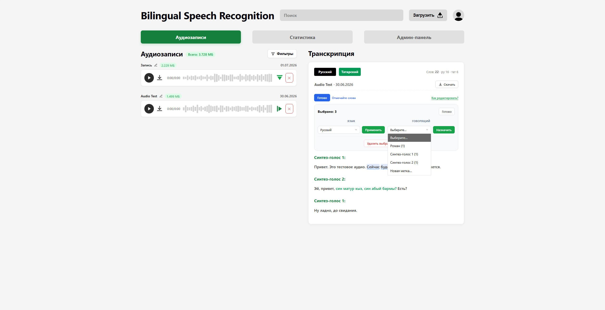
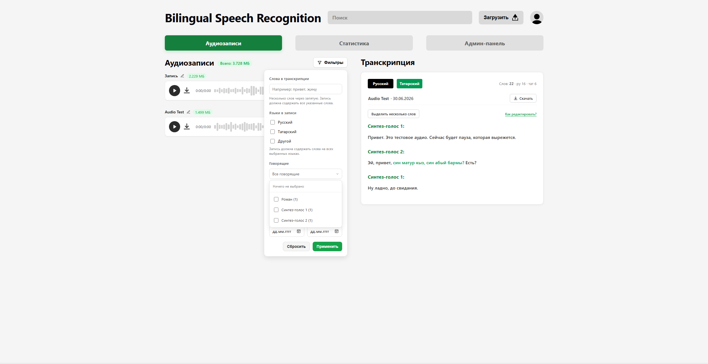
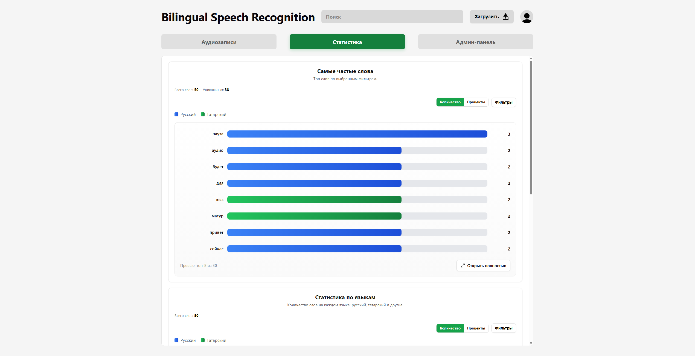
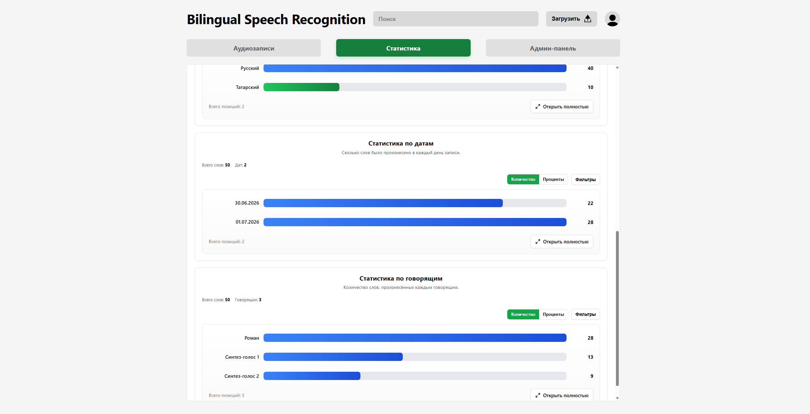

# Assignment 6 – Week 6 Report

---

## Project Information

### Project Name

Bilingual Speech Recognition

### Project Description

Bilingual Speech Recognition is a web-based application designed to support the transcription and analysis of bilingual Russian–Tatar speech recordings. The system allows users to upload audio files, generate transcriptions, and identify language usage within recordings.

---

## Product Backlog and Sprint

### Sprint Information

**Sprint Goal:** Develop early statistics and fix ocurred bugs.

**Sprint Dates:** 06.07-12.07

**Sprint Scope Summary:** Statistics tab, design improvements.

**Total Sprint Size:** 25

### Links

- [Product Backlog Board](https://github.com/orgs/SWP-Team20/projects/1/views/7)
- [Sprint Backlog Board](https://github.com/orgs/SWP-Team20/projects/1/views/8?sliceBy%5Bvalue%5D=Sprint+4)
- [Sprint Milestone](https://github.com/SWP-Team20/Bilingual-speech-recognition/milestone/4)
- [Roadmap](/docs/roadmap.md)

---

## Delivered Product

### Customer Feedback Response Table

| Feedback point | Resulting PBI or issue | Status | Response |
|---|---|---|---|
| Manager/admin should be able to change speakers' labels in transcriptions | https://github.com/SWP-Team20/Bilingual-speech-recognition/issues/261 | Done | Now it is possible to change speaker's label in transcription |
| Downloading .json/.txt transcription is needed | https://github.com/SWP-Team20/Bilingual-speech-recognition/issues/263 | Done | Download button was added to transcription window |
| Researchers should be able to select speaker and see their words by audios | https://github.com/SWP-Team20/Bilingual-speech-recognition/issues/257 | Ready | Planned for the next sprint |

Feedback not addressed:
- Statistics implementation was discussed more in details with customer, thus [US-003: Transcription](https://github.com/SWP-Team20/Bilingual-speech-recognition/issues/10) was split into:
  - [US-026: Per-speaker statistics](https://github.com/SWP-Team20/Bilingual-speech-recognition/issues/254)
  - [US-027: Per-language statistics](https://github.com/SWP-Team20/Bilingual-speech-recognition/issues/254)
  - [US-028: Per-date statistics](https://github.com/SWP-Team20/Bilingual-speech-recognition/issues/254)

### Summary of Delivered Trial Release Changes

This update adds comprehensive statistical tracking for speakers, words, and languages, alongside enhanced transcription editing tools like bulk selection, export options, and soft deletion. Additionally, the release improves the user interface with updated modals and layout refinements, while resolving key authentication timeouts and formatting bugs.

### Release

 [INSERT SCREENSHOT]

### Product Screenshots

### Links

- [SemVer Release](...) [INSERT LINK]
- [Deployed Product](https://10.93.26.206:5173)
- [Access Instructions (README.md)](/README.md)
- [Deployment Insctructions](/docs/deployment.md)
- [LLM Report](...) [INSERT LINK]

---

## Testing, Architecture, and Development-Process

### Updates

- Expanded [QRT-004 authorization tests](/scripts/QualityRequirements/test_authorization.py): role checks on admin user list, transcript edit, and transcription download (`403` for JSON format for the `user` role; `404` for missing resources).
- Added statistics filter unit tests in [`test_word_stats.py`](/scripts/Unit/test_word_stats.py) and [`test_audio_filter_stats.py`](/scripts/Unit/test_audio_filter_stats.py) (corpus filters for stats sections, including per-audio scoping).
- Added transcription undo unit tests in [`test_transcript_undo.py`](/scripts/Unit/test_transcript_undo.py) (undo snapshot stack push, depth limit, restore).
- Extended [`test_transcript_edit.py`](/scripts/Unit/test_transcript_edit.py) with bulk language assignment and bulk delete coverage.
- Added audio soft-delete unit tests in [`test_audio_soft_delete.py`](/scripts/Unit/test_audio_soft_delete.py) (30 s undo window, restore, expired restore).
- Added user soft-delete unit tests in [`test_user_soft_delete.py`](/scripts/Unit/test_user_soft_delete.py) (same pattern as audio soft delete for admin user removal).
- Updated [`docs/testing.md`](/docs/testing.md): new critical modules (`audio_soft_delete`, `user_soft_delete`), suite size **94** pytest tests (**77** unit · **3** integration · **13** QRT · **1** supplementary perf).
- Added manual UAT scenarios **UAT-006–UAT-011** in [`docs/user-acceptance-tests.md`](/docs/user-acceptance-tests.md): transcription word undo, audio/user soft-delete undo toasts, bulk word edit, statistics audio filter, metadata edit from transcription header.
- Frontend UX changes covered by UAT (not automated pytest): custom `SelectDropdown` alignment fix, inline transcription undo strip, timed undo toasts, clickable transcription title/date modal, extended JWT session with silent refresh (`POST /auth/refresh`).
- Now backend tests use cache and do not install dependencies at the fresh start, which improved testss performance.

### Links

- [Definition of Done](/docs/definition-of-done.md)
- [Quality Requirements](/docs/quality-requirements.md)
- [Quality Requirement Tests Artifact](/docs/quality-requirements-tests.md)
- [Testing Artifact](/docs/testing.md)
- [User Acceptance Tests](/docs/user-acceptance-tests.md)
- [CI Pipeline](/.github/workflows/quality-requirements-tests.yml)
- [Architecture Artifact](/docs/architecture/README.md)
- [Static View](/docs/architecture/static-view/static.md)
- [Dynamic View](/docs/architecture/dynamic-view/dynamic.md)
- [Deployment View](/docs/architecture/deployment-view/deployment.md)
- [ADR Directory](/docs/architecture/adr)
- [Development Process](/docs/development-process.md)

---

## Customer Meeting

### Customer-Facing Documentation Review Summary

[INSERT DESCRIPTION]

### Transition-Readiness Summary

[INSERT DESCRIPTION]

### UAT/Customer-Trial Results Summary

[INSERT DESCRIPTION]

### Links

- [Customer Handover](...) [INSERT LINK]
- [Customer Review Transcript](...) [INSERT LINK]
- [Customer Review Summary](...) [INSERT LINK]

---

## Product Development Perspectives

### Current Product Status

All core features that were required by the customer are implemented.

### Next Steps

Refine the features, hotfix the bugs, and polish the product.

### Contribution Traceability Table

| Team Member   | Issues       | PRs          | Reviews      |
| ------------- | ------------ | ------------ | ------------ |
| AaalekseevP | https://github.com/SWP-Team20/Bilingual-speech-recognition/issues/248 https://github.com/SWP-Team20/Bilingual-speech-recognition/issues/249 https://github.com/SWP-Team20/Bilingual-speech-recognition/issues/262 https://github.com/SWP-Team20/Bilingual-speech-recognition/issues/263 https://github.com/SWP-Team20/Bilingual-speech-recognition/issues/264 https://github.com/SWP-Team20/Bilingual-speech-recognition/issues/280 https://github.com/SWP-Team20/Bilingual-speech-recognition/issues/287 https://github.com/SWP-Team20/Bilingual-speech-recognition/issues/288 https://github.com/SWP-Team20/Bilingual-speech-recognition/issues/289 https://github.com/SWP-Team20/Bilingual-speech-recognition/issues/290 https://github.com/SWP-Team20/Bilingual-speech-recognition/issues/294 | https://github.com/SWP-Team20/Bilingual-speech-recognition/pull/265 https://github.com/SWP-Team20/Bilingual-speech-recognition/pull/276 https://github.com/SWP-Team20/Bilingual-speech-recognition/pull/278 https://github.com/SWP-Team20/Bilingual-speech-recognition/pull/281 https://github.com/SWP-Team20/Bilingual-speech-recognition/pull/282 https://github.com/SWP-Team20/Bilingual-speech-recognition/pull/286 https://github.com/SWP-Team20/Bilingual-speech-recognition/pull/291 https://github.com/SWP-Team20/Bilingual-speech-recognition/pull/295 | https://github.com/SWP-Team20/Bilingual-speech-recognition/pull/273 https://github.com/SWP-Team20/Bilingual-speech-recognition/pull/274 https://github.com/SWP-Team20/Bilingual-speech-recognition/pull/277 https://github.com/SWP-Team20/Bilingual-speech-recognition/pull/284 https://github.com/SWP-Team20/Bilingual-speech-recognition/pull/285 https://github.com/SWP-Team20/Bilingual-speech-recognition/pull/293 |
| StreetSraker | https://github.com/SWP-Team20/Bilingual-speech-recognition/issues/5 https://github.com/SWP-Team20/Bilingual-speech-recognition/issues/247 https://github.com/SWP-Team20/Bilingual-speech-recognition/issues/261 https://github.com/SWP-Team20/Bilingual-speech-recognition/issues/254 https://github.com/SWP-Team20/Bilingual-speech-recognition/issues/255 https://github.com/SWP-Team20/Bilingual-speech-recognition/issues/256 https://github.com/SWP-Team20/Bilingual-speech-recognition/issues/283 https://github.com/SWP-Team20/Bilingual-speech-recognition/issues/292 | https://github.com/SWP-Team20/Bilingual-speech-recognition/pull/273 https://github.com/SWP-Team20/Bilingual-speech-recognition/pull/274 https://github.com/SWP-Team20/Bilingual-speech-recognition/pull/275 https://github.com/SWP-Team20/Bilingual-speech-recognition/pull/277 https://github.com/SWP-Team20/Bilingual-speech-recognition/pull/284 https://github.com/SWP-Team20/Bilingual-speech-recognition/pull/285 https://github.com/SWP-Team20/Bilingual-speech-recognition/pull/293 | https://github.com/SWP-Team20/Bilingual-speech-recognition/pull/265 https://github.com/SWP-Team20/Bilingual-speech-recognition/pull/278 https://github.com/SWP-Team20/Bilingual-speech-recognition/pull/281 https://github.com/SWP-Team20/Bilingual-speech-recognition/pull/282 https://github.com/SWP-Team20/Bilingual-speech-recognition/pull/286 https://github.com/SWP-Team20/Bilingual-speech-recognition/pull/291 https://github.com/SWP-Team20/Bilingual-speech-recognition/pull/295 |
| ProPupok | — | — | https://github.com/SWP-Team20/Bilingual-speech-recognition/pull/275 https://github.com/SWP-Team20/Bilingual-speech-recognition/pull/276 |
| lohmo111* | — | — | — |
| anakin-shitcoder | — | — | — |

\* Trained ASR model on Russian and Tatar speech, which is out of GitHub scope

### Example Reviewed Issue-Linked PR

### Links

- [CONTRIBUTING.md](...) [INSERT LINK]
- [AGENTS.md](...) [INSERT LINK]
- [Hosted Documentation Site](https://swp-team20.github.io/Bilingual-speech-recognition)
- [Reflection](...) [INSERT LINK]
- [Retrospective](...) [INSERT LINK]
