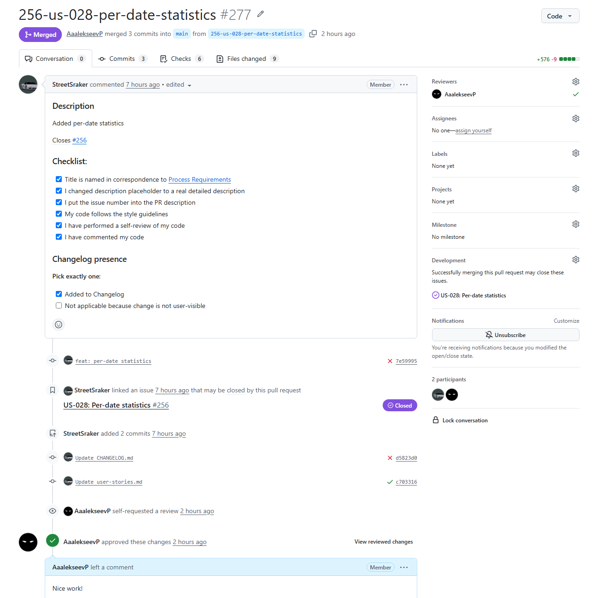

# Assignment 6 – Week 6 Report

----

## Project Information

### Project Name

Bilingual Speech Recognition

### Project Description

Bilingual Speech Recognition is a web-based application designed to support the transcription and analysis of bilingual Russian–Tatar speech recordings. The system allows users to upload audio files, generate transcriptions, and identify language usage within recordings.

---

## Product Backlog and Sprint

### Sprint Information

**Sprint Goal:** Develop early statistics and fix ocurred bugs.

**Sprint Dates:** 06.07-12.07

**Sprint Scope Summary:** Statistics tab, design improvements.

**Total Sprint Size:** 19

 [INSERT SCREENSHOT]

### Links:

- [Product Backlog Board](https://github.com/orgs/SWP-Team20/projects/1/views/7)
- [Sprint Backlog Board](https://github.com/orgs/SWP-Team20/projects/1/views/8?sliceBy%5Bvalue%5D=Sprint+4)
- [Sprint Milestone](https://github.com/SWP-Team20/Bilingual-speech-recognition/milestone/4)
- [Roadmap](/docs/roadmap.md)

---

## Delivered Product

### Customer Feedback Response Table

| Feedback point | Resulting PBI or issue | Status | Response |
|---|---|---|---|
| Manager/admin should be able to change speakers' labels in transcriptions | https://github.com/SWP-Team20/Bilingual-speech-recognition/issues/261 | In progress | — |
| Downloading .json/.txt transcription is needed | https://github.com/SWP-Team20/Bilingual-speech-recognition/issues/263 | In progress | — |
| Researchers should be able to select speaker and see their words by audios | https://github.com/SWP-Team20/Bilingual-speech-recognition/issues/257 | Ready | Planned for the next sprint |

Feedback not addressed:
- Statistics implementation was discussed more in details with customer, thus [US-003: Transcription](https://github.com/SWP-Team20/Bilingual-speech-recognition/issues/10) was split into:
  - [US-026: Per-speaker statistics](https://github.com/SWP-Team20/Bilingual-speech-recognition/issues/254)
  - [US-027: Per-language statistics](https://github.com/SWP-Team20/Bilingual-speech-recognition/issues/254)
  - [US-028: Per-date statistics](https://github.com/SWP-Team20/Bilingual-speech-recognition/issues/254)

### Summary of Delivered Trial Release Changes

[INSERT DESCRIPTION]

### Release

 [INSERT SCREENSHOT]

### Product Screenshots

 [INSERT SCREENSHOT]

 [INSERT SCREENSHOT]

 [INSERT SCREENSHOT]

### Links:

- [SemVer Release](...) [INSERT LINK]
- [Deployed Product](https://10.93.26.206:5173)
- [Access Instructions (README.md)](/README.md)
- [Deployment Insctructions](/docs/deployment.md)
- [LLM Report](...) [INSERT LINK]

---

## Testing, Architecture, and Development-Process

### Updates

Added authorization tests in [QRT-004](/scripts/QualityRequirements/test_authorization.py).

### Links

- [Definition of Done](/docs/definition-of-done.md)
- [Quality Requirements](/docs/quality-requirements.md)
- [Quality Requirement Tests Artifact](/docs/quality-requirements-tests.md)
- [Testing Artifact](/docs/testing.md)
- [User Acceptance Tests](/docs/user-acceptance-tests.md)
- [CI Pipeline](/.github/workflows/quality-requirements-tests.yml)
- [Architecture Artifact](/docs/architecture/README.md)
- [Static View](/docs/architecture/static-view/static.md)
- [Dynamic View](/docs/architecture/dynamic-view/dynamic.md)
- [Deployment View](/docs/architecture/deployment-view/deployment.md)
- [ADR Directory](/docs/architecture/adr)
- [Development Process](/docs/development-process.md)

---

## Customer Meeting

### Customer-Facing Documentation Review Summary

[INSERT DESCRIPTION]

### Transition-Readiness Summary

[INSERT DESCRIPTION]

### UAT/Customer-Trial Results Summary

[INSERT DESCRIPTION]

### Links

- [Customer Handover](...) [INSERT LINK]
- [Customer Review Transcript](...) [INSERT LINK]
- [Customer Review Summary](...) [INSERT LINK]

---

## Product Development Perspectives

### Current Product Status

[INSERT DESCRIPTION]

### Next Steps

[INSERT DESCRIPTION]

### Contribution Traceability Table

| Team Member   | Issues       | PRs          | Reviews      |
| ------------- | ------------ | ------------ | ------------ |
| AaalekseevP | https://github.com/SWP-Team20/Bilingual-speech-recognition/issues/248 https://github.com/SWP-Team20/Bilingual-speech-recognition/issues/249 https://github.com/SWP-Team20/Bilingual-speech-recognition/issues/264 https://github.com/SWP-Team20/Bilingual-speech-recognition/issues/280 | https://github.com/SWP-Team20/Bilingual-speech-recognition/pull/265 https://github.com/SWP-Team20/Bilingual-speech-recognition/pull/276 https://github.com/SWP-Team20/Bilingual-speech-recognition/pull/278 https://github.com/SWP-Team20/Bilingual-speech-recognition/pull/281 | https://github.com/SWP-Team20/Bilingual-speech-recognition/pull/273 https://github.com/SWP-Team20/Bilingual-speech-recognition/pull/274 https://github.com/SWP-Team20/Bilingual-speech-recognition/pull/277 |
| StreetSraker | https://github.com/SWP-Team20/Bilingual-speech-recognition/issues/5 https://github.com/SWP-Team20/Bilingual-speech-recognition/issues/254 https://github.com/SWP-Team20/Bilingual-speech-recognition/issues/255 https://github.com/SWP-Team20/Bilingual-speech-recognition/issues/256 | https://github.com/SWP-Team20/Bilingual-speech-recognition/pull/273 https://github.com/SWP-Team20/Bilingual-speech-recognition/pull/274 https://github.com/SWP-Team20/Bilingual-speech-recognition/pull/275 https://github.com/SWP-Team20/Bilingual-speech-recognition/pull/277 | https://github.com/SWP-Team20/Bilingual-speech-recognition/pull/265 https://github.com/SWP-Team20/Bilingual-speech-recognition/pull/278 https://github.com/SWP-Team20/Bilingual-speech-recognition/pull/281 |
| ProPupok | — | — | https://github.com/SWP-Team20/Bilingual-speech-recognition/pull/275 https://github.com/SWP-Team20/Bilingual-speech-recognition/pull/276 |
| lohmo111* | — | — | — |
| anakin-shitcoder | — | — | — |

\* Trained ASR model on Russian and Tatar speech, which is out of GitHub scope

### Example Reviewed Issue-Linked PR

### Links

- [CONTRIBUTING.md](...) [INSERT LINK]
- [AGENTS.md](...) [INSERT LINK]
- [Hosted Documentation Site](https://swp-team20.github.io/Bilingual-speech-recognition)
- [Reflection](...) [INSERT LINK]
- [Retrospective](...) [INSERT LINK]
