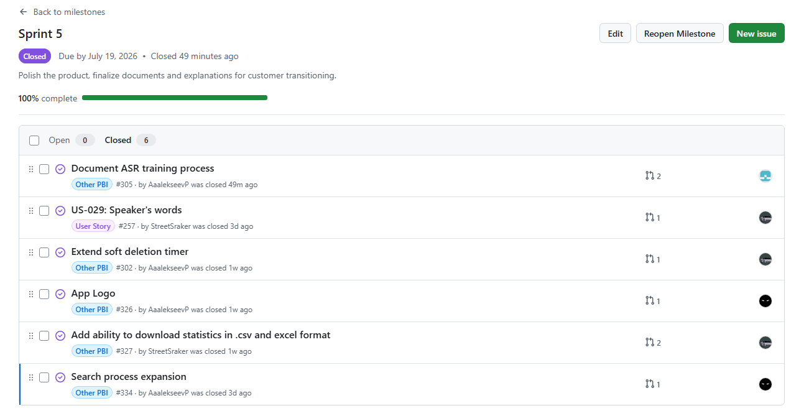
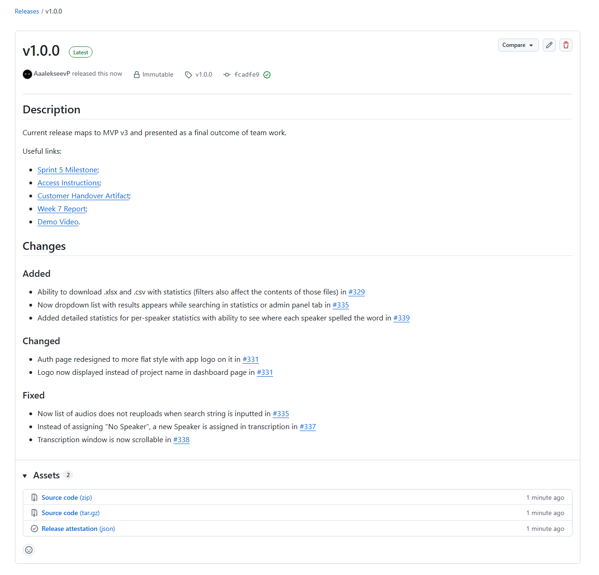
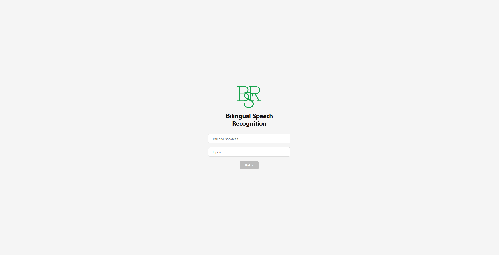
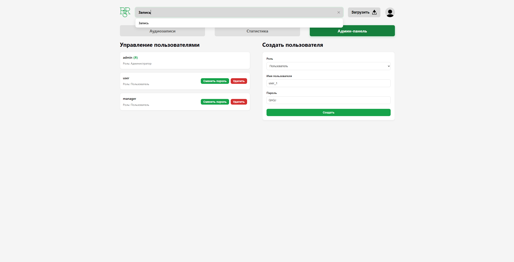
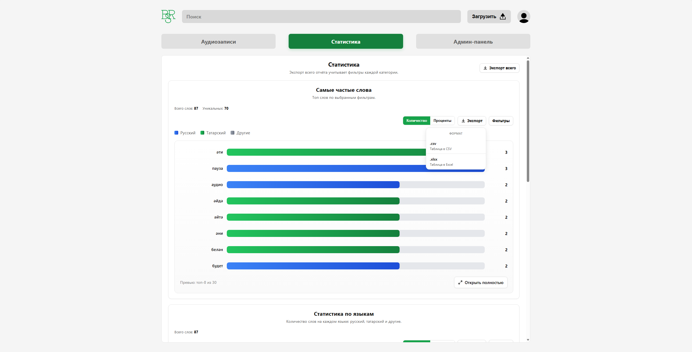
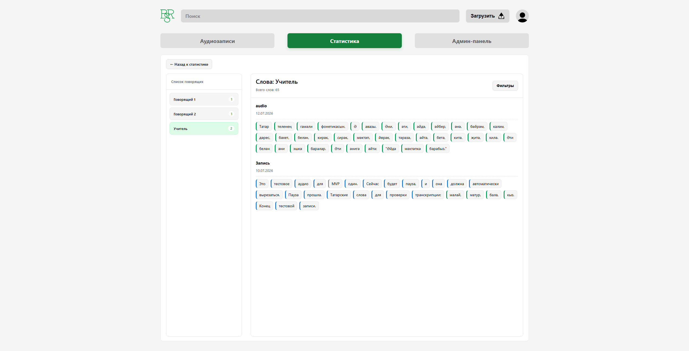
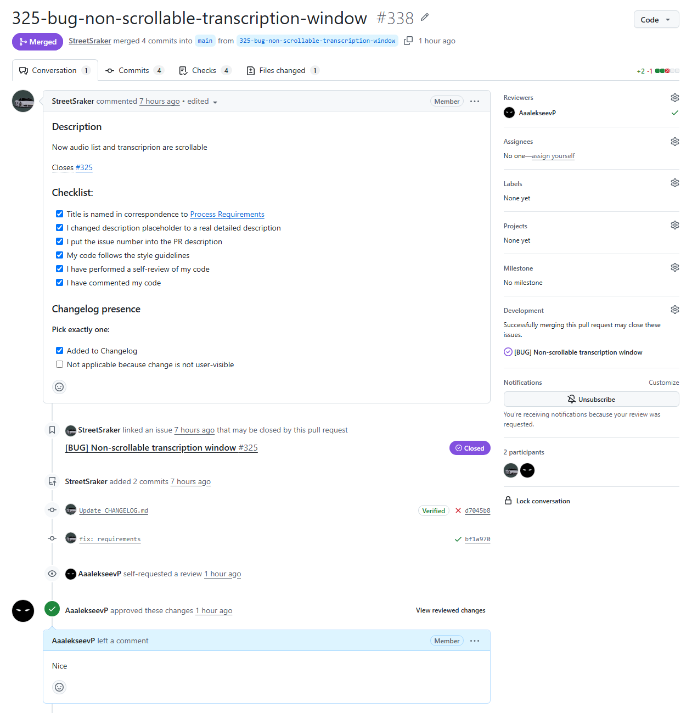

# Assignment 6 – Week 7 Report

---

## Product Backlog and Sprint

### Sprint Information

**Sprint Goal:** Polish the product, finalize documents and explanations for customer transitioning.

**Sprint Dates:** 13.07-19.07

**Sprint Scope Summary:** Product without bugs and ready for transition.

**Total Sprint Size:** 8

### Links

- [Product Backlog Board](https://github.com/orgs/SWP-Team20/projects/1/views/7)
- [Sprint Backlog Board](https://github.com/orgs/SWP-Team20/projects/1/views/8?sliceBy%5Bvalue%5D=Sprint+5)
- [Sprint Milestone](https://github.com/SWP-Team20/Bilingual-speech-recognition/milestone/5)

---

## Delivered Product

### Customer Feedback Response Table

| Feedback point | Resulting PBI or issue | Status | Response |
|---|---|---|---|
| Researchers should be able to select speaker and see their words by audios | https://github.com/SWP-Team20/Bilingual-speech-recognition/issues/257 | Done | Tab with detailed statistics about speakers is added |
| Soft deletion timer should be extended from 30s to 60s | https://github.com/SWP-Team20/Bilingual-speech-recognition/issues/302 | Done | Implemented in product |
| Customer team should understand how to train ASR model | https://github.com/SWP-Team20/Bilingual-speech-recognition/issues/305 | Done | Everything was documented in `docs/asr-training-guide.md` |

All feedback by the customer was adressed.

### Final MVP v3 Changes

This update enhances analytics with detailed speaker tracking,, and data exports. Additionally, it delivers key usability fixes, including smoother audio searching and an improved, scrollable transcription workflow, as well as quality-of-life upgrades inclusing redesign of auth page and new logo.

### Release

### Product Screenshots

### Links

- [SemVer Release](https://github.com/SWP-Team20/Bilingual-speech-recognition/releases/tag/v1.0.0)
- [Deployed Product](https://10.93.26.206:5173)
- [Demo Video of Release](https://drive.google.com/file/d/17Kira2H3KBdDgE8D3Ns9m5iyMH3USgCS/view?usp=drive_link)
- [Access Instructions (README.md)](/README.md)
- [Deployment Insctructions](/docs/deployment.md)
- [LLM Report](llm-report.md)

---

## Customer Meeting

### Final Transition Outcome Summary

Documents have been refined to assist with transition for better customer-understanding. Customer marked the product as ready for independent use and overall success.

### Summary of What Was Transferred

Link to the product repository with brief instructions on documentation, product guide.

### Summary of Customer-Independent Use

Customer was not been able to connect to Innopolis network to access the product, but admitted that product is ready for their independent use.

### UAT/Customer-Trial Results Summary

Customer has completed one active UAT-012 was completed via screen-sharing.

### Remaining Transition Blockers, Limitations, Support Expectations, Or Follow-Up Items

No blockers have been identified for the team.

### Links

- [Customer Handover](/docs/customer-handover.md)
- [Customer Review Transcript](customer-review-transcript.md)
- [Customer Review Summary](customer-review-summary.md)

---

## Product Development

### Final Product Status

Product is done and team was able to complete all PBIs planned. It is ready for independent use and available open-source.

### Demo Day Preparation Summary

Presentation was refined and required Week 7 rehearsal preparation was completed.

### Contribution Traceability Table

| Team Member   | Issues       | PRs          | Reviews      |
| ------------- | ------------ | ------------ | ------------ |
| AaalekseevP | https://github.com/SWP-Team20/Bilingual-speech-recognition/issues/323 https://github.com/SWP-Team20/Bilingual-speech-recognition/issues/326 https://github.com/SWP-Team20/Bilingual-speech-recognition/issues/334 https://github.com/SWP-Team20/Bilingual-speech-recognition/issues/340 https://github.com/SWP-Team20/Bilingual-speech-recognition/issues/344 https://github.com/SWP-Team20/Bilingual-speech-recognition/issues/345 https://github.com/SWP-Team20/Bilingual-speech-recognition/issues/347 https://github.com/SWP-Team20/Bilingual-speech-recognition/issues/348 https://github.com/SWP-Team20/Bilingual-speech-recognition/issues/355 https://github.com/SWP-Team20/Bilingual-speech-recognition/issues/361 | https://github.com/SWP-Team20/Bilingual-speech-recognition/pull/331 https://github.com/SWP-Team20/Bilingual-speech-recognition/pull/335 https://github.com/SWP-Team20/Bilingual-speech-recognition/pull/336 https://github.com/SWP-Team20/Bilingual-speech-recognition/pull/341 https://github.com/SWP-Team20/Bilingual-speech-recognition/pull/352 https://github.com/SWP-Team20/Bilingual-speech-recognition/pull/356 https://github.com/SWP-Team20/Bilingual-speech-recognition/pull/358 https://github.com/SWP-Team20/Bilingual-speech-recognition/pull/359 https://github.com/SWP-Team20/Bilingual-speech-recognition/pull/360 https://github.com/SWP-Team20/Bilingual-speech-recognition/pull/363 https://github.com/SWP-Team20/Bilingual-speech-recognition/pull/364 https://github.com/SWP-Team20/Bilingual-speech-recognition/pull/365 | https://github.com/SWP-Team20/Bilingual-speech-recognition/pull/333 https://github.com/SWP-Team20/Bilingual-speech-recognition/pull/337 https://github.com/SWP-Team20/Bilingual-speech-recognition/pull/338 https://github.com/SWP-Team20/Bilingual-speech-recognition/pull/339 https://github.com/SWP-Team20/Bilingual-speech-recognition/pull/349 https://github.com/SWP-Team20/Bilingual-speech-recognition/pull/351 https://github.com/SWP-Team20/Bilingual-speech-recognition/pull/353 https://github.com/SWP-Team20/Bilingual-speech-recognition/pull/354 https://github.com/SWP-Team20/Bilingual-speech-recognition/pull/362 |
| StreetSraker | https://github.com/SWP-Team20/Bilingual-speech-recognition/issues/257 https://github.com/SWP-Team20/Bilingual-speech-recognition/issues/302 https://github.com/SWP-Team20/Bilingual-speech-recognition/issues/324 https://github.com/SWP-Team20/Bilingual-speech-recognition/issues/325 https://github.com/SWP-Team20/Bilingual-speech-recognition/issues/327 https://github.com/SWP-Team20/Bilingual-speech-recognition/issues/330 https://github.com/SWP-Team20/Bilingual-speech-recognition/issues/342 https://github.com/SWP-Team20/Bilingual-speech-recognition/issues/350 | https://github.com/SWP-Team20/Bilingual-speech-recognition/pull/328 https://github.com/SWP-Team20/Bilingual-speech-recognition/pull/329 https://github.com/SWP-Team20/Bilingual-speech-recognition/pull/332 https://github.com/SWP-Team20/Bilingual-speech-recognition/pull/333 https://github.com/SWP-Team20/Bilingual-speech-recognition/pull/337 https://github.com/SWP-Team20/Bilingual-speech-recognition/pull/338 https://github.com/SWP-Team20/Bilingual-speech-recognition/pull/339 https://github.com/SWP-Team20/Bilingual-speech-recognition/pull/349 https://github.com/SWP-Team20/Bilingual-speech-recognition/pull/351 | https://github.com/SWP-Team20/Bilingual-speech-recognition/pull/335 https://github.com/SWP-Team20/Bilingual-speech-recognition/pull/336 https://github.com/SWP-Team20/Bilingual-speech-recognition/pull/341 https://github.com/SWP-Team20/Bilingual-speech-recognition/pull/352 https://github.com/SWP-Team20/Bilingual-speech-recognition/pull/356 https://github.com/SWP-Team20/Bilingual-speech-recognition/pull/358 https://github.com/SWP-Team20/Bilingual-speech-recognition/pull/359 https://github.com/SWP-Team20/Bilingual-speech-recognition/pull/360 https://github.com/SWP-Team20/Bilingual-speech-recognition/pull/363 https://github.com/SWP-Team20/Bilingual-speech-recognition/pull/364 https://github.com/SWP-Team20/Bilingual-speech-recognition/pull/365 |
| ProPupok | — | — | https://github.com/SWP-Team20/Bilingual-speech-recognition/pull/328 https://github.com/SWP-Team20/Bilingual-speech-recognition/pull/329 https://github.com/SWP-Team20/Bilingual-speech-recognition/pull/331 https://github.com/SWP-Team20/Bilingual-speech-recognition/pull/332 |
| lohmo111 | https://github.com/SWP-Team20/Bilingual-speech-recognition/issues/305 https://github.com/SWP-Team20/Bilingual-speech-recognition/issues/343 | https://github.com/SWP-Team20/Bilingual-speech-recognition/pull/353 https://github.com/SWP-Team20/Bilingual-speech-recognition/pull/362 | — |
| anakin-shitcoder | https://github.com/SWP-Team20/Bilingual-speech-recognition/issues/346 | https://github.com/SWP-Team20/Bilingual-speech-recognition/pull/354 | — |

### Example Reviewed Issue-Linked PR

### Links

- [Week 6 Report](../week6/README.md)
- [CONTRIBUTING.md](/CONTRIBUTING.md)
- [AGENTS.md](/AGENTS.md)
- [Hosted Documentation Site](https://swp-team20.github.io/Bilingual-speech-recognition)
- [Reflection](reflection.md)
- [Retrospective](retrospective.md)
